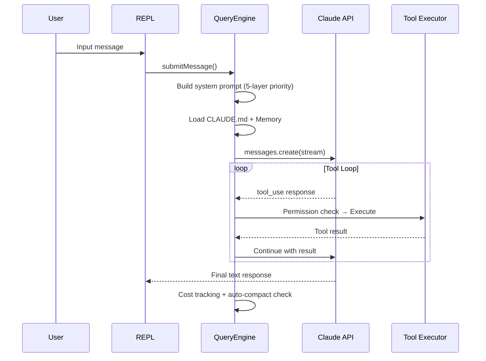

# Claude Code Unveiled

**The first architecture deep-dive, hidden feature catalog, and cost optimization guide for Claude Code — based on v2.1.88 source analysis (1,884 files, 132K lines of TypeScript).**

[中文版](README_CN.md) | English

---

> On March 31, 2026, Claude Code's TypeScript source (1,884 files, ~132K lines) was exposed through an unstripped `.map` file in the npm package. This repository includes the **complete restored source code** in `src/` plus original analysis. This project extracts **actionable insights** — architecture patterns, hidden features, cost optimization, and best practices — all with source file references.

## Table of Contents

- [System Prompt (Complete Reconstruction)](#system-prompt-complete-reconstruction)
- [87 Hidden Feature Flags](#87-hidden-feature-flags)
- [15 Hidden Slash Commands](#15-hidden-slash-commands)
- [25 Internal-Only Commands](#25-internal-only-commands)
- [Undercover Mode (How Anthropic Hides AI Attribution)](#undercover-mode)
- [Cost Optimization (10 Tips from Source)](#cost-optimization)
- [Architecture Diagrams](#architecture-diagrams)
- [Claude Code vs Cursor vs Cline](#claude-code-vs-cursor-vs-cline)
- [Telemetry & Privacy](#telemetry--what-data-is-collected)
- [Remote Control & Killswitches](#remote-control--killswitches)
- [Future Roadmap (Unreleased Features)](#unreleased-features--future-roadmap)
- [CLAUDE.md Best Practices](#claudemd-best-practices)

---

## System Prompt (Complete Reconstruction)

> [Full document](practical/system-prompts.md) | Source: `src/constants/prompts.ts`, `src/utils/systemPrompt.ts`

### 5-Layer Priority System

```
Priority 0: Override (loop mode, testing)        ← highest
Priority 1: Coordinator (multi-worker orchestration)
Priority 2: Agent (subagent definitions)
Priority 3: Custom (--system-prompt flag)
Priority 4: Default (standard Claude Code)       ← lowest
         + appendSystemPrompt (always appended unless override)
```

### What the Default Prompt Actually Says

The system prompt is **9 major sections**:

1. **Identity** — "You are an interactive agent that helps users with software engineering tasks"
2. **System Rules** — Tool execution, permission modes, prompt injection detection
3. **Task Execution** — The most detailed section:
   - Read code before modifying (mandatory)
   - Don't add unrequested features/refactoring
   - Don't create helpers for one-time operations
   - "Three similar lines of code is better than a premature abstraction"
   - Avoid OWASP Top 10 vulnerabilities
4. **Careful Actions** — Destructive operations need user confirmation (rm -rf, force push, etc.)
5. **Tool Usage** — Use dedicated tools (Read/Edit/Glob/Grep) instead of Bash
6. **Tone** — No emojis, concise, `file_path:line_number` format
7. **Output Efficiency** — "If you can say it in one sentence, don't use three"
8. **Cache Boundary** — `__SYSTEM_PROMPT_DYNAMIC_BOUNDARY__` splits static/dynamic parts
9. **Environment** — CWD, platform, model name, knowledge cutoff

### Cache Optimization

The prompt is split by `__SYSTEM_PROMPT_DYNAMIC_BOUNDARY__`:
- **Before boundary (static)**: Cached globally, saves tokens on repeat calls
- **After boundary (dynamic)**: User/session-specific, recalculated each time (memory, MCP, language, etc.)

### Model Knowledge Cutoffs

| Model | Display Name | Cutoff |
|-------|-------------|--------|
| claude-opus-4-6 | Claude Opus 4.6 | May 2025 |
| claude-sonnet-4-6 | Claude Sonnet 4.6 | August 2025 |
| claude-haiku-4-5 | Claude Haiku 4.5 | February 2025 |

---

## 87 Hidden Feature Flags

> [Full document](practical/hidden-configs.md) | Source: `src/commands.ts`, various

These are compile-time switches via `bun:bundle feature()`. Most are dead-code-eliminated in the public npm build.

### Core Codenames

| Codename | What It Does | Cross-file References |
|----------|-------------|----------------------|
| **KAIROS** | Autonomous assistant platform (assistant mode, brief, channels, cron, webhooks) | 210 files |
| **PROACTIVE** | Proactive task planning and automation | Linked to KAIROS |
| **COORDINATOR_MODE** | Multi-agent orchestration with workers | 45 files |
| **VOICE_MODE** | Voice input/output with cross-platform binaries | 38 files |
| **BUDDY** | AI companion sprite with animation system | 14 files, 1,298 lines |
| **ULTRATHINK** | Extended deep reasoning mode | Compile-time |
| **ULTRAPLAN** | Super planner with selection dialog | Compile-time |
| **TORCH** | Inference enhancement | Compile-time |
| **BRIDGE_MODE** | Mobile/web remote control | Compile-time |
| **CHICAGO_MCP** | Computer-use MCP server | Internal |

### Context & Compression

| Flag | Purpose |
|------|---------|
| CONTEXT_COLLAPSE | Smart context folding |
| REACTIVE_COMPACT | Reactive session compression |
| CACHED_MICROCOMPACT | Micro cache compression |
| HISTORY_SNIP | History message fragmentation |
| BG_SESSIONS | Background session management |
| AWAY_SUMMARY | Auto-summary when user is away |

### Obfuscated Runtime Config (tengu_* gates)

Runtime flags use `tengu_` + **random word pairs** to deliberately hide their purpose:

```
tengu_frond_boric       → Analytics killswitch (Datadog/FirstParty)
tengu_passport_quail    → Memory extraction gate
tengu_moth_copse        → Memory extraction enable
tengu_bramble_lintel    → Memory extraction frequency
tengu_cicada_nap_ms     → Background refresh throttle
tengu_slate_prism       → Connector text summarization
tengu_amber_json_tools  → JSON tool format (token-efficient)
tengu_tool_pear         → Structured output (strict tools)
```

---

## 15 Hidden Slash Commands

> Source: `src/commands.ts`

These require specific feature flags to appear:

| Command | Function | Required Flag |
|---------|----------|---------------|
| `/assistant` | Assistant mode | KAIROS |
| `/brief` | Brief messages | KAIROS_BRIEF |
| `/bridge` | Remote control bridge | BRIDGE_MODE |
| `/voice` | Voice mode | VOICE_MODE |
| `/buddy` | AI companion sprite | BUDDY |
| `/ultraplan` | Super planner | ULTRAPLAN |
| `/torch` | Inference boost | TORCH |
| `/workflows` | Workflow scripts | WORKFLOW_SCRIPTS |
| `/fork` | Subagent branching | FORK_SUBAGENT |
| `/peers` | Peer messaging | UDS_INBOX |
| `/proactive` | Proactive planning | PROACTIVE |
| `/force-snip` | Force history snip | HISTORY_SNIP |
| `/subscribe-pr` | PR subscriptions | KAIROS_GITHUB_WEBHOOKS |
| `/remote-setup` | Remote CCR setup | CCR_REMOTE_SETUP |
| `/remote-control-server` | Remote control server | DAEMON + BRIDGE_MODE |

## 25 Internal-Only Commands

> Condition: `USER_TYPE === 'ant' && !IS_DEMO`

| Command | Function |
|---------|----------|
| `/bughunter` | Automated bug detection |
| `/good-claude` | Model evaluation tool |
| `/commit` | Hidden git commit |
| `/commit-push-pr` | One-click commit → push → create PR |
| `/ctx-viz` | Context visualization |
| `/break-cache` | Force cache invalidation |
| `/mock-limits` | Simulate rate limits |
| `/reset-limits` | Reset rate limits |
| `/ant-trace` | Anthropic internal tracing |
| `/perf-issue` | Performance diagnostics |
| `/debug-tool-call` | Tool call debugger |
| `/agents-platform` | Agents platform management |
| `/autofix-pr` | Auto-fix PR |
| `/backfill-sessions` | Backfill session data |
| `/share` | Session sharing |
| `/summary` | Session summary |
| `/onboarding` | Onboarding flow |
| `/init-verifiers` | Initialize verifiers |
| `/bridge-kick` | Kick bridge connection |
| `/version` | Version display |
| `/oauth-refresh` | OAuth token refresh |
| `/env` | Environment variables |
| `/issue` | Issue tracking |
| `/teleport` | Session teleport |
| `/tags` | Session tags |

---

## Undercover Mode

> [Full document](analysis/en/undercover-mode.md) | Source: `src/utils/undercover.ts`

When Anthropic employees (`USER_TYPE=ant`) work in public repositories, Claude Code **automatically hides all internal information**.

### How It Works

```
isUndercover() check:
  USER_TYPE !== 'ant' → always OFF (external users unaffected)
  USER_TYPE === 'ant' →
    CLAUDE_CODE_UNDERCOVER=1 → forced ON
    Repo in internal allowlist → OFF
    Repo is public/unknown → ON (safe default)
```

**There is NO force-OFF option.** If Claude Code can't confirm it's an internal repo, undercover stays ON.

### What Gets Injected

```
## UNDERCOVER MODE — CRITICAL

You are operating UNDERCOVER in a PUBLIC/OPEN-SOURCE repository.
NEVER include in commit messages or PR descriptions:
- Internal model codenames (Capybara, Tengu, etc.)
- Unreleased model version numbers
- Internal repo or project names
- The phrase "Claude Code" or any mention that you are an AI
- Co-Authored-By lines or any other attribution
```

### Internal Repo Allowlist (22 private repos)

```
anthropics/claude-cli-internal, anthropics/anthropic, anthropics/apps,
anthropics/casino, anthropics/dbt, anthropics/dotfiles,
anthropics/terraform-config, anthropics/hex-export, anthropics/feedback-v2,
anthropics/labs, anthropics/argo-rollouts, anthropics/starling-configs,
anthropics/ts-tools, anthropics/ts-capsules, anthropics/feldspar-testing,
anthropics/trellis, anthropics/claude-for-hiring, anthropics/forge-web,
anthropics/infra-manifests, anthropics/mycro_manifests,
anthropics/mycro_configs, anthropics/mobile-apps
```

Source: `src/utils/commitAttribution.ts` lines 30-75

---

## Cost Optimization

> [Full document](practical/cost-optimization.md) | Sources: `src/utils/modelCost.ts`, `src/utils/context.ts`, `src/services/compact/`

### Model Pricing (per million tokens)

| Model | Input | Output | Cache Read | Cache Write |
|-------|-------|--------|------------|------------|
| Haiku 4.5 | $1 | $5 | $0.10 | $1.25 |
| Sonnet 4.6 | $3 | $15 | $0.30 | $3.75 |
| Opus 4.6 | $5 | $25 | $0.50 | $6.25 |
| **Opus 4.6 Fast** | **$30** | **$150** | **$3.00** | **$37.50** |

> Fast mode is **6x the price**. Use it only for short, time-sensitive tasks.

Source: `src/utils/modelCost.ts` lines 36-69

### 10 Money-Saving Tips

| # | Tip | Source Evidence |
|---|-----|----------------|
| 1 | Output reservation is 8K (not 32K) — auto-escalates to 64K on hit | `context.ts:24-25` |
| 2 | Keep CLAUDE.md under 500 words — it's sent with every request | `context.ts` getUserContext() |
| 3 | Use `/compact` proactively — manual compact uses only 3K buffer vs auto's 13K | `autoCompact.ts:62,65` |
| 4 | Don't switch models mid-session — 18 dimensions of cache invalidation | `promptCacheBreakDetection.ts:28-99` |
| 5 | Fast mode = 6x cost — toggle off for long tasks | `modelCost.ts:62-69` |
| 6 | API Key users default to Sonnet (cheaper) — don't switch to Opus unless needed | `model.ts:178-207` |
| 7 | Set `CLAUDE_CODE_SUBAGENT_MODEL=haiku` — subagents do simple tasks, 5x cheaper | `agent.ts:37-95` |
| 8 | Background tasks never retry 429/529 errors (built-in, saves cascade costs) | `withRetry.ts:62-88` |
| 9 | Post-compact file restore is budgeted: 5 files max, 5K tokens each | `compact.ts:122-130` |
| 10 | Cache reads are 90% off — keep system prompt stable to maximize cache hits | `modelCost.ts` |

### Key Thresholds

```
Context window:        200,000 tokens
Auto-compact trigger:  ~167,000 tokens (200K - 20K output - 13K buffer)
Manual compact buffer:   3,000 tokens
Default max_output:      8,000 tokens (escalates to 64,000 on retry)
Session memory min:     10,000 tokens
Session memory max:     40,000 tokens
Post-compact restore:   50,000 tokens budget, 5 files max
```

---

## Architecture Diagrams

### Request Lifecycle

> [Full document](architecture/query-lifecycle.md)



### Tool System

> [Full document](architecture/tool-system.md)

**40+ built-in tools across 4 permission levels:**

| Level | Auto-Allow | Examples |
|-------|-----------|---------|
| 0 | Always | Read, Glob, Grep, LSP, TaskGet, ToolSearch |
| 1 | First-time confirm | Write, Edit, WebFetch, WebSearch, Bash (safe) |
| 2 | Every-time confirm | Bash (dangerous: rm, git push, chmod) |
| 3 | Block + warn | rm -rf /, git push --force origin main, DROP TABLE |

### Permission Model

> [Full document](architecture/permission-model.md)

```
4 modes: Default (ask) → Plan (read-only) → Auto (smart judge) → Bypass (allow all)
```

### Multi-Agent Architecture

> [Full document](architecture/multi-agent.md)

```
Main Thread → Agent tool → Subagent (fresh context, isolated)
                        → Subagent (can use different model)
                        → Subagent (can run in git worktree)
```

Subagent model priority: `CLAUDE_CODE_SUBAGENT_MODEL` env > tool-specified > agent config > inherit parent

---

## Claude Code vs Cursor vs Cline

> Full documents: [vs Cursor](comparison/vs-cursor.md) | [vs Cline](comparison/vs-cline.md) | [Feature Matrix](comparison/feature-matrix.md)

| Aspect | Claude Code | Cursor | Cline |
|--------|------------|--------|-------|
| **Form** | Terminal CLI | VS Code fork | VS Code extension |
| **Models** | Claude only | OpenAI/Claude/Gemini/xAI | Any OpenAI-compatible |
| **Open Source** | No | No | Yes (Apache 2.0) |
| **Max Context** | 1M tokens | ~272K (RAG) | Provider-dependent |
| **Multi-Agent** | Subagents (unlimited) | 8 parallel | Single only |
| **Permission** | 4-level classification | Implicit trust | Per-action approval |
| **Memory** | Persistent cross-session | Session only | None |
| **Cost** | Per-token / subscription | $20-40/month | Free (BYO keys) |
| **Codebase Search** | ripgrep on-demand | AST + embeddings index | VS Code search |
| **Automation** | Hooks + Skills | Limited | Limited |

---

## Telemetry — What Data Is Collected

> [Full document](analysis/en/telemetry.md) | Source: `src/services/analytics/`

### Dual-Channel Architecture

```
Claude Code → First-Party (api.anthropic.com/api/event_logging/batch)  [640+ event types]
           → Datadog (us5.datadoghq.com)                              [64 allowed events]
           → BigQuery Metrics (api.anthropic.com/api/claude_code/metrics)
```

### What's Collected

- **Environment**: platform, arch, terminal, package managers, runtimes, CI detection
- **User ID**: device_id (de-identified), user_bucket (SHA256 % 30), session_id
- **Events**: session lifecycle, API calls (model, tokens, latency), tool usage, permission decisions, voice toggles
- **NOT collected by default**: user prompts (requires `OTEL_LOG_USER_PROMPTS=1`), full file paths (extension only)

### How to Disable

```bash
DISABLE_TELEMETRY=1                              # Disable analytics
CLAUDE_CODE_DISABLE_NONESSENTIAL_TRAFFIC=1       # Disable all non-API network
```

---

## Remote Control & Killswitches

> [Full document](analysis/en/remote-control.md) | Source: `src/services/remoteManagedSettings/`

### Polling Mechanism

- **Endpoint**: `{BASE_URL}/api/claude_code/settings`
- **Interval**: Every 1 hour
- **Cache**: ETag-based with SHA256 checksum verification
- **Failure mode**: Fail-open (continues working with cached/default settings)

### Known Killswitches

| Switch | Controls |
|--------|---------|
| `tengu_frond_boric` | Analytics data flow (Datadog/FirstParty) |
| `tengu_auto_mode_config` | Auto mode enable/disable |
| Statsig gate | Permission bypass control |
| `tengu_bridge_poll_interval_config` | Bridge polling frequency |
| `tengu_kairos_cron_config` | KAIROS cron task rate limiting |
| `tengu_event_sampling_config` | Event sampling rate (0-100%) |

### Remotely Modifiable Behaviors

Data reporting, auto mode, permission bypass, polling frequency, event sampling, model routing, memory system, cache strategy, Bash classification, version limits.

---

## Unreleased Features — Future Roadmap

> [Full document](analysis/en/roadmap.md)

Assessed by **verifiable code metrics**, not subjective percentages:

| Feature | Dedicated Code | Cross-file References | Infrastructure |
|---------|---------------|----------------------|----------------|
| **KAIROS** | 597 lines | **210 files** | 3 GrowthBook gates |
| **Voice Mode** | 54 lines | 38 files | 6-platform native binaries |
| **Coordinator** | 369 lines | 45 files | Dedicated system prompt |
| **Buddy** | 1,298 lines | 14 files | Animation + notification system |
| **UltraPlan/Think/Torch** | Command registration | Scattered | Compile-time flags |
| **Web Browser** | 0 files (in npm) | Feature-gated | Likely in internal monorepo |

**108 modules** are dead-code-eliminated from the npm build and exist only in Anthropic's internal monorepo.

---

## CLAUDE.md Best Practices

> [Full document](practical/claude-md-guide.md) | Source: `src/context.ts`

### Loading Order

```
~/.claude/CLAUDE.md (global) + project/CLAUDE.md (project) + .claude/CLAUDE.md
  → Merged → Injected into system prompt dynamic section → Sent with EVERY request
```

### Recommended Template

```markdown
# CLAUDE.md

## Tech Stack
- Language: TypeScript 5.x, strict mode
- Framework: Next.js 14, App Router
- Testing: vitest
- Package manager: pnpm

## Conventions
- Components: PascalCase, hooks: camelCase
- Commits: conventional commits (feat/fix/chore)

## Project Structure
- src/app/ — routes
- src/components/ — shared components
- src/lib/ — utilities
```

### What NOT to Write

- Don't repeat system prompt rules (already hardcoded)
- Don't write long descriptions (wastes tokens every request)
- Don't paste API docs (let Claude read the actual files)
- Don't put TODO lists (use conversation, not CLAUDE.md)

---

## Accuracy & Methodology

Based on **static source code reading** of Claude Code v2.1.88:

- All numeric constants verified against source with file paths and line numbers
- Architecture diagrams are simplified — actual flow may have uncaptured edge cases
- Feature assessments use verifiable metrics (file count, LOC, cross-references)
- Cursor/Cline comparison uses public documentation; internals may differ
- **No code was executed or tested at runtime**

**Found an error? Open an issue with the source file and line number.**

## Disclaimer

- **NOT affiliated with, endorsed by, or maintained by Anthropic**
- All original source code is Anthropic's intellectual property
- For **educational and security research purposes only**
- **No proprietary source code is redistributed** — all content is original analysis

## License

Analysis and documentation: MIT | Original Claude Code source: Anthropic (all rights reserved)
