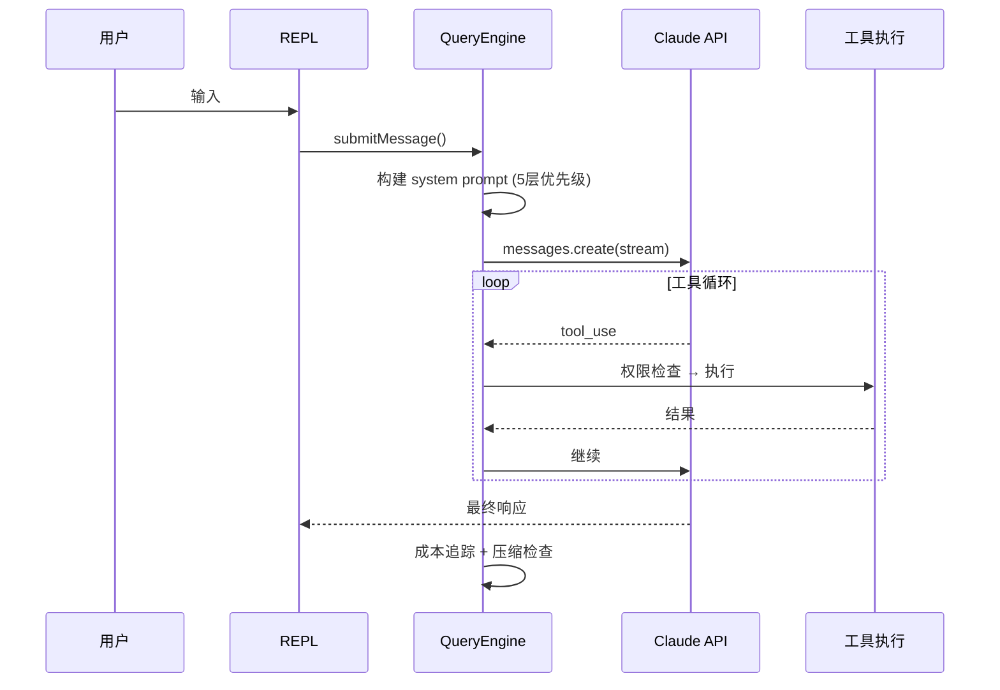

# Claude Code 深度揭秘

**首个基于源码分析的 Claude Code 架构拆解、隐藏功能手册与省钱指南 — 基于 v2.1.88（1,884 个文件，13.2 万行 TypeScript）**

[English](README.md) | 中文版

---

> 2026 年 3 月 31 日，Claude Code 的 TypeScript 源码（1,884 个文件，约 13.2 万行）因 npm 包中未清理的 `.map` 文件泄露。本仓库包含 `src/` 目录下的**完整还原源码**及原创分析。本项目提取**可操作的洞察** — 架构图解、隐藏功能、省钱技巧、最佳实践，全部标注源码文件和行号。

## 目录

- [System Prompt 完整还原](#system-prompt-完整还原)
- [87 个隐藏 Feature Flags](#87-个隐藏-feature-flags)
- [15 个隐藏斜杠命令](#15-个隐藏斜杠命令)
- [25 个内部专用命令](#25-个内部专用命令)
- [卧底模式（Anthropic 如何隐藏 AI 归属）](#卧底模式)
- [省钱指南（10 个源码级技巧）](#省钱指南)
- [架构图解](#架构图解)
- [Claude Code vs Cursor vs Cline](#claude-code-vs-cursor-vs-cline)
- [遥测与隐私](#遥测--采集了什么数据)
- [远程控制与紧急开关](#远程控制与紧急开关)
- [未发布功能与路线图](#未发布功能与路线图)
- [CLAUDE.md 最佳实践](#claudemd-最佳实践)

---

## System Prompt 完整还原

> [完整文档](practical/system-prompts.md) | 源码: `src/constants/prompts.ts`, `src/utils/systemPrompt.ts`

### 5 层优先级

```
优先级 0: Override (loop 模式、测试)          ← 最高
优先级 1: Coordinator (多 worker 编排)
优先级 2: Agent (子代理定义)
优先级 3: Custom (--system-prompt 参数)
优先级 4: Default (标准 Claude Code)          ← 最低
       + appendSystemPrompt (总是追加)
```

### 默认 Prompt 的 9 大组成

1. **身份** — "You are an interactive agent that helps users with software engineering tasks"
2. **系统规则** — 工具执行、权限模式、提示注入检测
3. **任务执行**（最核心）— 修改前必须读代码、不加未要求的功能、"三行相似代码优于过早抽象"
4. **谨慎操作** — 破坏性操作需确认
5. **工具使用** — 专用工具优先于 Bash
6. **语气** — 不用 emoji、简洁
7. **输出效率** — "一句话能说清的，不用三句话"
8. **缓存边界** — `__SYSTEM_PROMPT_DYNAMIC_BOUNDARY__` 分隔静态/动态部分
9. **环境信息** — 工作目录、平台、模型、知识截止日期

---

## 87 个隐藏 Feature Flags

> [完整文档](practical/hidden-configs.md) | 源码: `src/commands.ts`

### 核心代号

| 代号 | 功能 | 跨文件引用数 |
|------|------|------------|
| **KAIROS** | 自主助手平台（助手模式/简报/频道/定时/Webhook） | 210 个文件 |
| **COORDINATOR_MODE** | 多智能体协调 | 45 个文件 |
| **VOICE_MODE** | 语音交互（跨平台二进制已就绪） | 38 个文件 |
| **BUDDY** | AI 伙伴精灵动画系统 | 14 个文件 |
| **ULTRATHINK** | 深度扩展推理 | 编译时 |
| **ULTRAPLAN** | 超级规划器 | 编译时 |
| **TORCH** | 推理增强 | 编译时 |
| **BRIDGE_MODE** | 移动/Web 远程控制 | 编译时 |
| **CHICAGO_MCP** | 计算机控制 MCP | 内部 |

### 混淆命名的运行时配置 (tengu_*)

```
tengu_frond_boric       → 分析数据流紧急开关
tengu_passport_quail    → 记忆提取门控
tengu_moth_copse        → 记忆提取启用
tengu_cicada_nap_ms     → 后台刷新节流
tengu_amber_json_tools  → JSON 工具格式
tengu_tool_pear         → 结构化输出
```

---

## 15 个隐藏斜杠命令

| 命令 | 功能 | 开启条件 |
|------|------|---------|
| `/assistant` | 助手模式 | KAIROS |
| `/brief` | Brief 消息 | KAIROS_BRIEF |
| `/voice` | 语音模式 | VOICE_MODE |
| `/buddy` | AI 精灵 | BUDDY |
| `/ultraplan` | 超级规划 | ULTRAPLAN |
| `/torch` | 推理增强 | TORCH |
| `/bridge` | 远程桥接 | BRIDGE_MODE |
| `/workflows` | 工作流脚本 | WORKFLOW_SCRIPTS |
| `/fork` | 子代理分支 | FORK_SUBAGENT |
| `/peers` | 同行消息 | UDS_INBOX |
| `/proactive` | 主动规划 | PROACTIVE |
| `/force-snip` | 强制片段化 | HISTORY_SNIP |
| `/subscribe-pr` | PR 订阅 | KAIROS_GITHUB_WEBHOOKS |
| `/remote-setup` | 远程设置 | CCR_REMOTE_SETUP |
| `/remote-control-server` | 远程控制服务器 | DAEMON + BRIDGE_MODE |

## 25 个内部专用命令

条件: `USER_TYPE === 'ant' && !IS_DEMO`

`/bughunter` `/good-claude` `/commit` `/commit-push-pr` `/ctx-viz` `/break-cache` `/mock-limits` `/reset-limits` `/ant-trace` `/perf-issue` `/debug-tool-call` `/agents-platform` `/autofix-pr` `/backfill-sessions` `/share` `/summary` `/onboarding` `/init-verifiers` `/bridge-kick` `/version` `/oauth-refresh` `/env` `/issue` `/teleport` `/tags`

---

## 卧底模式

> [完整文档](analysis/zh/undercover-mode.md) | 源码: `src/utils/undercover.ts`

Anthropic 员工在公开仓库工作时，Claude Code **自动隐藏所有内部信息**。

**注入的强制指令:**
```
UNDERCOVER MODE — CRITICAL
NEVER include: 内部代号(Capybara/Tengu)、未发布版本号、
内部仓库名、"Claude Code"字样、Co-Authored-By 归属
```

**22 个内部仓库白名单**: `anthropics/claude-cli-internal`, `anthropics/anthropic`, `anthropics/apps` 等。

**没有强制关闭选项** — 无法确认内部仓库时，默认开启卧底。

---

## 省钱指南

> [完整文档](practical/cost-optimization.md) | 源码: `src/utils/modelCost.ts`, `src/utils/context.ts`

### 定价表（每百万 token）

| 模型 | 输入 | 输出 | 缓存读 | 缓存写 |
|------|------|------|--------|--------|
| Haiku 4.5 | $1 | $5 | $0.10 | $1.25 |
| Sonnet 4.6 | $3 | $15 | $0.30 | $3.75 |
| Opus 4.6 | $5 | $25 | $0.50 | $6.25 |
| **Opus 4.6 快速** | **$30** | **$150** | **$3.00** | **$37.50** |

> 快速模式是普通模式的 **6 倍价格**。

### 10 个省钱技巧

| # | 技巧 | 源码依据 |
|---|------|---------|
| 1 | 输出预留 8K（不是 32K）— 命中限制自动升到 64K | `context.ts:24-25` |
| 2 | CLAUDE.md 控制在 500 字内 — 每次请求都发送 | `context.ts` |
| 3 | 主动 `/compact` — 手动压缩仅 3K 缓冲 vs 自动 13K | `autoCompact.ts:62,65` |
| 4 | 别频繁切模型 — 18 维度缓存失效检测 | `promptCacheBreakDetection.ts` |
| 5 | 快速模式 = 6 倍成本 | `modelCost.ts:62-69` |
| 6 | API Key 用户默认 Sonnet — 不需要就别切 Opus | `model.ts:178-207` |
| 7 | 设 `CLAUDE_CODE_SUBAGENT_MODEL=haiku` — 子代理用 Haiku 省 5 倍 | `agent.ts:37-95` |
| 8 | 后台任务不重试 429/529（内置，避免级联成本） | `withRetry.ts:62-88` |
| 9 | 压缩后恢复预算: 最多 5 文件，每个 5K tokens | `compact.ts:122-130` |
| 10 | 缓存读打 1 折 — 保持 system prompt 稳定 | `modelCost.ts` |

---

## 架构图解

> 完整文档: [工具系统](architecture/tool-system.md) | [请求生命周期](architecture/query-lifecycle.md) | [权限模型](architecture/permission-model.md) | [多代理](architecture/multi-agent.md)

### 请求生命周期



### 工具权限分级

| 级别 | 行为 | 示例 |
|------|------|------|
| 0 | 自动允许 | Read, Glob, Grep, LSP |
| 1 | 首次确认 | Write, Edit, WebFetch, Bash(安全) |
| 2 | 每次确认 | Bash(rm, git push, chmod) |
| 3 | 阻止+警告 | rm -rf /, git push --force, DROP TABLE |

---

## Claude Code vs Cursor vs Cline

> 完整文档: [vs Cursor](comparison/vs-cursor.md) | [vs Cline](comparison/vs-cline.md) | [功能矩阵](comparison/feature-matrix.md)

| 维度 | Claude Code | Cursor | Cline |
|------|------------|--------|-------|
| **形态** | 终端 CLI | VS Code 魔改版 | VS Code 插件 |
| **模型** | 仅 Claude | OpenAI/Claude/Gemini/xAI | 任意 |
| **开源** | 否 | 否 | 是 (Apache 2.0) |
| **上下文** | 1M tokens | ~272K (RAG) | 取决于模型 |
| **多代理** | 子代理(无限) | 8 个并行 | 仅单个 |
| **权限** | 4 级分类 | 隐式信任 | 逐操作确认 |
| **记忆** | 跨会话持久 | 仅会话内 | 无 |
| **成本** | 按 token / 订阅 | $20-40/月 | 免费(自带 key) |

---

## 遥测 — 采集了什么数据

> [完整文档](analysis/zh/telemetry.md) | 源码: `src/services/analytics/`

```
Claude Code → 第一方服务 (api.anthropic.com)  [640+ 事件类型]
           → Datadog (us5.datadoghq.com)     [64 种允许事件]
```

**采集**: 环境信息、设备 ID (哈希化)、会话 ID、API 调用 (模型/token/延迟)、工具使用、权限操作

**不采集**: 用户输入内容（默认）、完整文件路径（仅扩展名）

**禁用**: `DISABLE_TELEMETRY=1` 或 `CLAUDE_CODE_DISABLE_NONESSENTIAL_TRAFFIC=1`

---

## 远程控制与紧急开关

> [完整文档](analysis/zh/remote-control.md) | 源码: `src/services/remoteManagedSettings/`

- **轮询**: 每小时一次，ETag 缓存，SHA256 校验
- **故障处理**: Fail-open（服务不可用时正常工作）
- **6+ 紧急开关**: 可远程关闭数据上报、禁用自动模式、调整轮询频率、修改事件采样率

---

## 未发布功能与路线图

> [完整文档](analysis/zh/roadmap.md)

| 功能 | 专属代码 | 跨文件引用 | 基础设施 |
|------|---------|-----------|---------|
| **KAIROS** | 597 行 | **210 个文件** | 3 个 GrowthBook 门控 |
| **Voice Mode** | 54 行 | 38 个文件 | 6 平台原生二进制 |
| **Coordinator** | 369 行 | 45 个文件 | 专用 system prompt |
| **Buddy** | 1,298 行 | 14 个文件 | 动画 + 通知系统 |

**108 个模块**在 npm 发布版中被消除，仅存在于 Anthropic 内部 monorepo。

---

## CLAUDE.md 最佳实践

> [完整文档](practical/claude-md-guide.md) | 源码: `src/context.ts`

**加载顺序**: `~/.claude/CLAUDE.md` (全局) + `项目/CLAUDE.md` → 合并 → 注入 system prompt → **每次请求都发送**

**应该写**: 技术栈、代码约定、项目结构
**不应该写**: 重复 system prompt 规则、长篇说明、API 文档、TODO 列表

---

## 准确性与方法论

基于 Claude Code v2.1.88 **静态源码阅读**。数字常量已通过源码验证。架构图为简化表示。功能评估使用可验证指标。**未执行或运行时测试代码。**

## 免责声明

**与 Anthropic 无关，未获其认可。** 所有原始源代码为 Anthropic 知识产权。仅用于教育和安全研究。**不重新分发任何专有源代码。**

## License

分析和文档: MIT | Claude Code 原始源码: Anthropic（保留所有权利）
