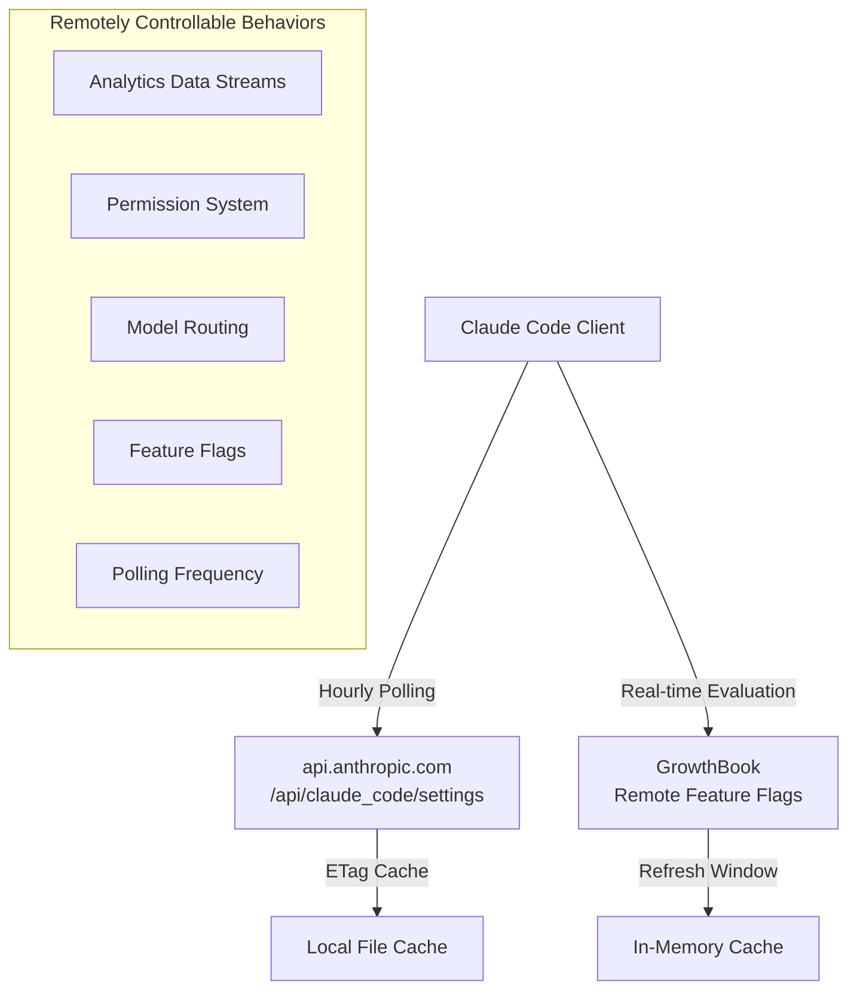

# Remote Control and Killswitches

> Anthropic can modify Claude Code's behavior in real time through remote configuration, and even completely disable certain features.

---

## Remote Management Architecture



---

## Remote Managed Settings (Enterprise Feature)

### Polling Mechanism

| Parameter | Value |
|-----------|-------|
| Polling interval | 1 hour (3,600,000ms) |
| HTTP timeout | 10 seconds |
| Load timeout | 30 seconds |
| Max retries | 5 (exponential backoff) |

### API Endpoint

```
GET {BASE_API_URL}/api/claude_code/settings
```

### Authentication Methods

| Method | Header | Applicable Users |
|--------|--------|-----------------|
| API Key | `x-api-key` | Console users |
| OAuth | `Bearer` + `anthropic-beta` | Claude.ai users |

### Eligibility Check

```
✓ Console users (with API Key) → All eligible
✓ OAuth Enterprise/C4E/Team users → Eligible
✗ Third-party providers (Bedrock/Vertex) → Not eligible
✗ Custom API URL → Not eligible
✗ Cowork VM environment → Not eligible
```

### HTTP Caching

- **ETag-based**: `If-None-Match` request header
- **304 Not Modified**: Uses cached version
- **Checksum verification**: SHA256 (compatible with Python `json.dumps(sort_keys=True)`)

### Security Check

User confirmation is required before settings are applied (`securityCheck.tsx`):
- Checks differences between old and new settings
- Users can reject remote configuration changes
- After rejection, cached settings are retained or empty settings are returned

### Failure Handling (Fail-Open)

```
Remote settings → Failed
    ↓
Disk cache → Does not exist
    ↓
Default settings → Continue working
```

**Source**: `src/services/remoteManagedSettings/`

---

## GrowthBook Feature Flags

### Integration Method

- **SDK**: `@growthbook/growthbook`
- **Mode**: Remote Eval (remote evaluation)
- **User targeting attributes**: id, platform, subscriptionType, appVersion, etc.

### Caching Strategy

| Method | Description |
|--------|-------------|
| `getFeatureValue_CACHED_MAY_BE_STALE()` | Returns potentially stale cached value |
| `getFeatureValue_CACHED_WITH_REFRESH()` | Cached with refresh window |
| `getDynamicConfig_CACHED_MAY_BE_STALE()` | Dynamic configuration cache |

**Source**: `src/services/analytics/growthbook.ts`

---

## Killswitch List

### Analytics Data Streams

| Switch | Controls | Effect |
|--------|----------|--------|
| `tengu_frond_boric` | Datadog + FirstParty | Completely disables data reporting |
| `tengu_event_sampling_config` | Event sampling rate | 0-100% sampling |
| `tengu_1p_event_batch_config` | Batch configuration | Adjusts batch size/interval |

### Permission System

| Switch | Controls | Effect |
|--------|----------|--------|
| `tengu_auto_mode_config` | Auto mode | Disable/enable/opt-in |
| Statsig gate | Permission bypass | Prohibits bypassPermissions |
| `TRANSCRIPT_CLASSIFIER` | Auto classifier | Toggles automatic permission judgment |

### Bridge Remote Control

| Switch | Controls | Effect |
|--------|----------|--------|
| `tengu_bridge_poll_interval_config` | Polling interval | Adjusts real-time communication frequency |
| `tengu_bridge_min_version` | Minimum version | Forces upgrade |
| `tengu_sessions_elevated_auth_enforcement` | Auth escalation | Forces stronger authentication |

**Bridge Polling Detailed Parameters**:

```typescript
{
  poll_interval_ms_not_at_capacity: 2000,      // 2 seconds when idle
  poll_interval_ms_at_capacity: 600000,        // 10 minutes at capacity
  session_keepalive_interval_v2_ms: 120000,    // 2-minute heartbeat
  reclaim_older_than_ms: 5000,                 // 5-second reclaim threshold
}
```

### KAIROS System

| Switch | Controls | Effect |
|--------|----------|--------|
| `tengu_kairos` | KAIROS main switch | Enables/disables assistant mode |
| `tengu_kairos_cron_config` | Scheduled tasks | Rate limits and frequency |
| `tengu_kairos_brief` | Brief feature | 5-minute refresh window |

### Memory System

| Switch | Controls | Effect |
|--------|----------|--------|
| `tengu_moth_copse` | Memory extraction | Enable/disable |
| `tengu_bramble_lintel` | Extraction frequency | Default 1 |
| `tengu_sm_compact_config` | Session compaction | Compaction parameters |

### Cache and Performance

| Switch | Controls | Effect |
|--------|----------|--------|
| `tengu_prompt_cache_1h_config` | Prompt cache | Cache parameters |
| `tengu_read_dedup_killswitch` | Read deduplication | Emergency disable |
| `tengu_compact_line_prefix_killswitch` | Line prefix compaction | Emergency disable |

---

## Complete List of Remotely Modifiable Behaviors

| Behavior | Remote Control Method | Impact Area |
|----------|----------------------|-------------|
| Data reporting | tengu_frond_boric | Privacy |
| Auto mode | tengu_auto_mode_config | Permissions |
| Permission bypass | Statsig gate | Security |
| Polling frequency | tengu_bridge_poll_interval_config | Performance |
| Event sampling | tengu_event_sampling_config | Telemetry |
| Model routing | tengu_ant_model_override | Functionality |
| Memory system | tengu_moth_copse | Functionality |
| Cache strategy | tengu_prompt_cache_1h_config | Performance |
| Bash classification | Shadow mode switch | Security |
| Version restriction | tengu_max_version_config | Release |

---

## Security Assessment

### Positives

- **Fail-Open Design**: Normal operation when remote services are unavailable
- **User Confirmation**: Enterprise setting changes require interactive user confirmation
- **Checksum Verification**: Prevents man-in-the-middle tampering
- **ETag Caching**: Reduces network overhead

### Risks

- **6+ killswitches** can remotely modify user behavior
- Permission system can be remotely adjusted (via Statsig gate)
- Analytics data streams can be remotely toggled
- Users **cannot audit** the history of remote configuration changes
- Polling interval can be remotely shortened (increasing network traffic)
