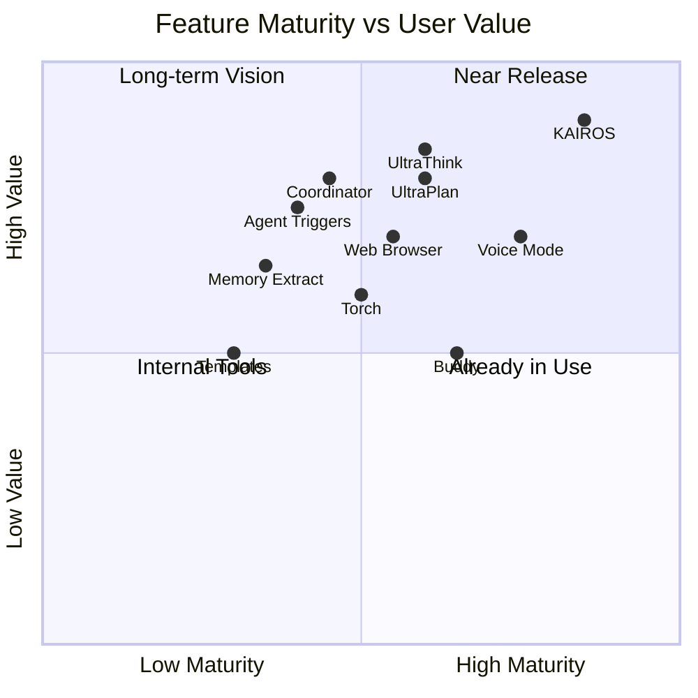

# Future Roadmap

> Inferring Claude Code's development direction from 87 feature flags and missing modules.

---

## Feature Maturity Map

---

## Tier 1: Near Release (Maturity 80%+)

### KAIROS -- Autonomous Assistant Platform

**This is Claude Code's largest unreleased feature.**

| Subsystem | Description | Maturity |
|-----------|-------------|----------|
| Assistant Mode | Assistant interaction mode | 95% |
| Brief Tool | Message checkpoints/briefings | 90% |
| Channels | Channel system (MCP integration) | 85% |
| Cron Tasks | Scheduled task scheduling | 85% |
| GitHub Webhooks | PR subscriptions and notifications | 80% |
| Push Notifications | Push notifications | 75% |
| Dream | Memory consolidation (offline learning) | 70% |

**Prediction**: KAIROS will be the core of Claude Code's transformation from a "coding tool" to an "autonomous development partner."

### Voice Mode -- Voice Interaction

| Component | Description |
|-----------|-------------|
| Voice STT | Speech-to-text |
| Audio Capture | Native audio capture (cross-platform .node modules) |
| Voice Integration Hook | React integration |

**Evidence**: `vendor/audio-capture/` contains native binaries for 6 platforms (arm64/x64 x darwin/linux/win32), indicating it has entered the cross-platform testing phase.

---

## Tier 2: Active Development (Maturity 50-80%)

### UltraPlan + UltraThink

- **UltraPlan**: Extended plan generation with selection dialogs
- **UltraThink**: Deep reasoning mode
- **Torch**: Reasoning enhancement (may complement UltraThink)

**Prediction**: These three may merge into a single "deep thinking" mode, comparable to o1/o3 competitors.

### Buddy -- AI Companion Sprite

- 45K bytes of CompanionSprite animation system
- Notification system
- Companion personality

**Prediction**: May be released as a differentiating feature for the desktop application, but likely lower priority than core features.

### Web Browser Tool

- Embedded browser in MCP tool format
- Panel UI

**Prediction**: This is a must-have for development tasks that require browsing documentation/web pages.

---

## Tier 3: Experimental Stage (Maturity 30-50%)

### Coordinator Mode -- Multi-Agent Coordination

Currently only 1 file (`src/coordinator/`), but:
- Already has a dedicated system prompt (priority 1)
- Can be enabled via environment variable
- Supports multi-worker allocation

**Prediction**: This is the foundation for evolving toward an "AI development team," but still needs time before public release.

### Agent Triggers -- Automated Agents

- Scheduled execution (cron scheduling)
- Remote triggering
- Deep integration with KAIROS

**Prediction**: Will become a key capability for CI/CD integration.

### Memory System -- Enhanced Memory

| Feature | Description |
|---------|-------------|
| Extract Memories | Automatically extract memories from conversations |
| Agent Memory Snapshot | Agent-level memory snapshots |
| Team Memory Sync | Team memory synchronization |
| Templates | Task templates and categorization |

**Prediction**: The memory system will evolve from "user-managed manually" to "AI learns automatically."

---

## Tier 4: 108 Missing Modules

The npm published version has 108 modules eliminated by dead-code-elimination, existing only in Anthropic's internal monorepo:

| Category | Includes |
|----------|----------|
| **Daemon** | Daemon system, background task scheduling |
| **Skill Discovery** | Skill search, skill generator |
| **Browser** | WebBrowserTool, REPL Tool |
| **Monitoring** | MonitorTool, performance tracing |
| **Remote** | Complete Bridge server-side, CCR images |
| **Collaboration** | Channel system, team memory sync |
| **AI Companion** | Complete Buddy sprite system |

---

## Development Direction Predictions

### Short-term (1-3 months)

1. **Voice Mode public release** -- Cross-platform binaries are ready
2. **UltraThink/UltraPlan merge** -- Deep reasoning mode
3. **Web Browser Tool** -- MCP integration

### Mid-term (3-6 months)

4. **KAIROS gradual rollout** -- From Enterprise to general availability
5. **Agent Triggers** -- CI/CD automation
6. **Coordinator Mode** -- Multi-agent collaboration

### Long-term (6-12 months)

7. **AI Development Team** -- Coordinator + KAIROS + Memory
8. **Autonomous Development Loop** -- Agent autonomously discovers issues -> fixes -> verifies
9. **Team Collaboration** -- Multi-person + multi-agent hybrid workflows

---

## Competitive Landscape Impact

| Feature | Claude Code | Cursor | Cline |
|---------|------------|--------|-------|
| Autonomous Agent (KAIROS) | In development | None | None |
| Voice Interaction | In development | None | None |
| Multi-agent Coordination | Experimental | None | None |
| AI Companion | Experimental | None | None |
| Deep Reasoning | In development | Partial | None |
| Web Browsing | In development | None | None |

**Conclusion**: Claude Code is evolving from an "AI coding assistant" to an "AI development platform," with a feature roadmap that far exceeds current competitors.
