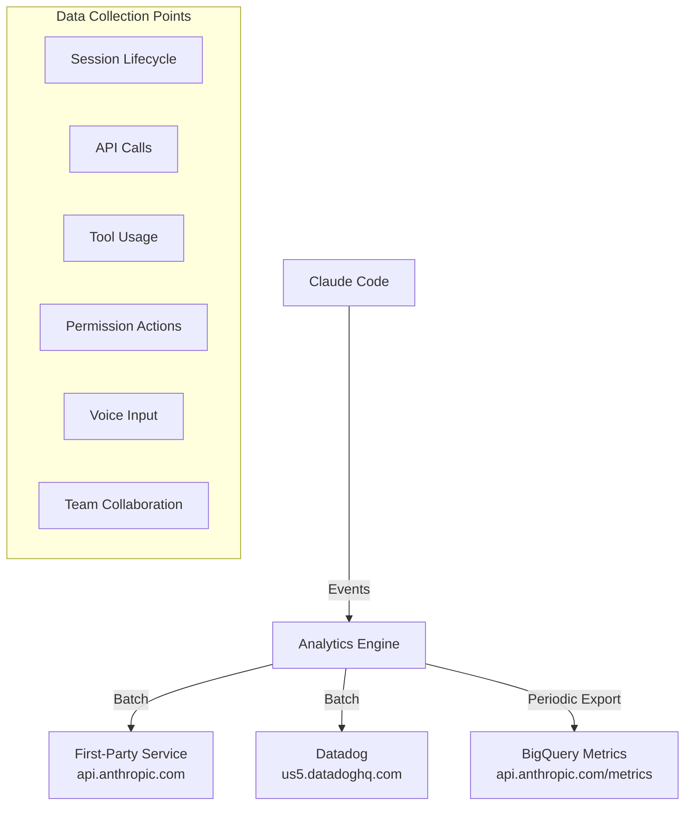

# Telemetry and Privacy Analysis

> Based on Claude Code v2.1.88 source code, a complete reconstruction of the data collection, transmission, and privacy protection mechanisms.

---

## Architecture Overview



## Dual-Channel Telemetry

### Channel 1: First-Party Event Logging

- **Endpoint**: `https://api.anthropic.com/api/event_logging/batch`
- **Batching**: 5-second delay or 200 events
- **Failure Handling**: Persisted to `~/.claude/telemetry/`, up to 8 retries with exponential backoff
- **Event Types**: 640+

**Source**: `src/services/analytics/firstPartyEventLoggingExporter.ts`

### Channel 2: Datadog

- **Endpoint**: `https://http-intake.logs.us5.datadoghq.com/api/v2/logs`
- **API Token**: `pubbbf48e6d78dae54bceaa4acf463299bf` (public token)
- **Batching**: 15 seconds or 100 events
- **Allowed Events**: 64 types (allowlist-filtered)
- **No Retries**: Sent asynchronously; dropped on failure

**Source**: `src/services/analytics/datadog.ts`

### Channel 3: BigQuery Metrics

- **Endpoint**: `https://api.anthropic.com/api/claude_code/metrics`
- **Interval**: 60 seconds
- **Requires API authentication**

**Source**: `src/utils/telemetry/bigqueryExporter.ts`

---

## Collected Data

### Environment Information

```typescript
{
  platform: 'darwin|win32|linux',
  arch: 'x64|arm64',
  node_version: string,
  terminal: string,
  package_managers: string,    // npm, yarn, pnpm...
  runtimes: string,            // python, node, ruby...
  is_ci: boolean,
  is_github_action: boolean,
  version: string,             // Claude Code version
  wsl_version: string,         // WSL version
  linux_distro_id: string,
}
```

### User Identifiers

| Field | Description | Privacy Treatment |
|-------|-------------|-------------------|
| device_id | Device identifier | De-identified |
| user_bucket | User hash bucket | 30 buckets (SHA256 modulo) |
| session_id | Session identifier | Ephemeral |
| user_type | User type | ant/external |
| subscription_type | Subscription type | max/pro/enterprise/team |

### Key Event Types

| Category | Example Events | Collected Data |
|----------|---------------|----------------|
| Session | `tengu_init/started/exit` | Startup time, exit reason |
| API | `tengu_api_success/error` | Model, token usage, latency, cache status |
| Tool | `tengu_tool_use_success/error` | Tool name (MCP tools anonymized as `mcp_tool`) |
| Permission | `tengu_tool_use_granted/rejected` | Authorization type (permanent/temporary/rejected) |
| Voice | `tengu_voice_toggled` | Toggle state |
| Team | `tengu_team_mem_sync_push/pull` | Sync operations |

---

## Privacy Protection Mechanisms

### 1. Tool Name Sanitization

```typescript
// MCP tool names are anonymized
mcp__my_secret_tool → mcp_tool
// Built-in tools retain their original names
Bash → Bash
```

**Source**: `src/services/analytics/metadata.ts`

### 2. File Path Protection

```
Only file extensions are recorded, not full paths
MAX_FILE_EXTENSION_LENGTH = 10
```

### 3. User ID Hashing

```typescript
// 30 buckets, impossible to reverse-identify specific users
getUserBucket() = SHA256(userId) % 30
```

### 4. Message Fingerprinting

```typescript
// Only takes characters at positions 4, 7, 20 + version number
// Cannot reconstruct the original message
fingerprint = SHA256(salt + char[4] + char[7] + char[20] + version)[:3]
```

### 5. User Prompts Not Recorded

```
User input content is not recorded by default
Must manually set OTEL_LOG_USER_PROMPTS=1 to enable
```

---

## How to Disable Telemetry

### Method 1: Disable Analytics Telemetry

```bash
export DISABLE_TELEMETRY=1
```

**Effect**: Disables Datadog, first-party event logging, and feedback surveys

### Method 2: Disable All Non-Essential Network Traffic

```bash
export CLAUDE_CODE_DISABLE_NONESSENTIAL_TRAFFIC=1
```

**Effect**: Disables all non-API communications

### Automatic Disabling

- `NODE_ENV=test` -- test environment
- Using third-party cloud providers (Bedrock/Vertex/Foundry)

---

## Remote Sampling Control

Anthropic can remotely adjust settings via GrowthBook:

```typescript
// Sampling rate configuration
tengu_event_sampling_config: { 'event_name': { sample_rate: 0.1 } }

// Data stream killswitch
tengu_frond_boric: { datadog: false, firstParty: false }
```

---

## Key Source Files

| File | Purpose |
|------|---------|
| `src/services/analytics/index.ts` | Analytics main entry |
| `src/services/analytics/datadog.ts` | Datadog integration |
| `src/services/analytics/firstPartyEventLogger.ts` | First-party events |
| `src/services/analytics/metadata.ts` | Metadata collection and sanitization |
| `src/services/analytics/config.ts` | Telemetry configuration |
| `src/services/analytics/growthbook.ts` | GrowthBook integration |
| `src/services/analytics/sinkKillswitch.ts` | Killswitch |
| `src/utils/telemetry/instrumentation.ts` | OpenTelemetry initialization |
| `src/utils/fingerprint.ts` | Fingerprint generation |

---

## Summary

| Dimension | Assessment |
|-----------|------------|
| Data Collection Scope | **Broad** -- 640+ event types covering nearly all operations |
| PII Protection | **Moderate** -- Hashed and anonymized, but environment fingerprints can still be correlated |
| User Control | **Limited** -- Telemetry can be disabled, but individual collection points cannot be selectively turned off |
| Transparency | **Low** -- No UI to display collected data; requires reading source code to understand |
| Remote Control | **Yes** -- Anthropic can remotely adjust sampling rates and killswitches |
