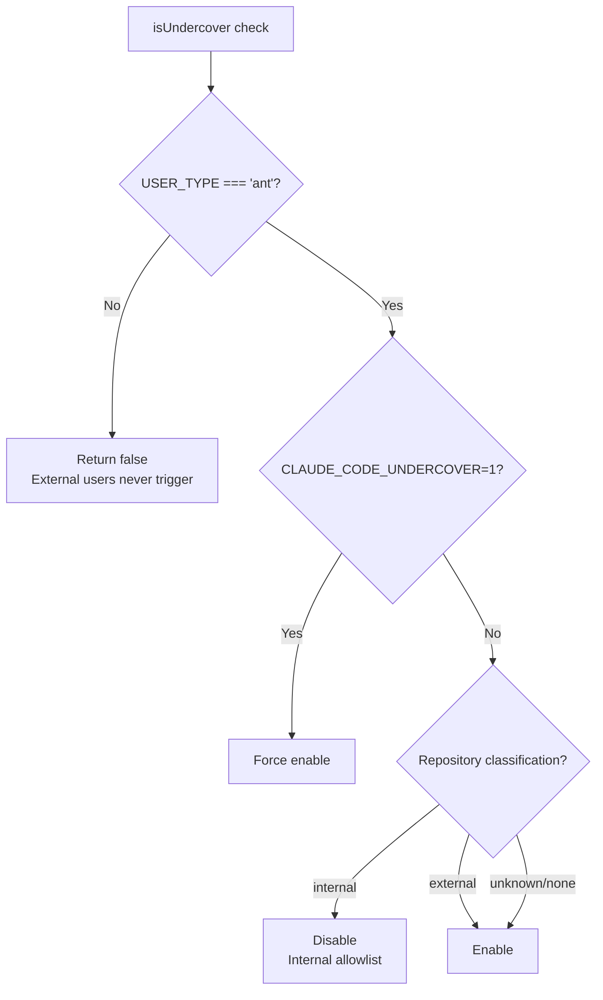

# Undercover Mode Analysis

> When Anthropic employees work in public repositories, Claude Code automatically hides all internal information.

---

## What Is Undercover Mode

When Anthropic employees (`USER_TYPE=ant`) use Claude Code in public or non-internal repositories, the system automatically activates "undercover mode," hiding all content that could expose internal information.

**This only affects Anthropic internal users; external users are completely unaffected.**

---

## Activation Conditions



**Key Design: Secure by Default** -- When the repository cannot be confirmed as internal, undercover mode is enabled by default.

**Source**: `src/utils/undercover.ts` lines 28-37

---

## Internal Repository Allowlist

The following repositories are classified as "internal," and undercover mode is **not** activated in them:

```
anthropics/claude-cli-internal
anthropics/anthropic
anthropics/apps
anthropics/casino
anthropics/dbt
anthropics/dotfiles
anthropics/terraform-config
anthropics/hex-export
anthropics/feedback-v2
anthropics/labs
anthropics/argo-rollouts
anthropics/starling-configs
anthropics/ts-tools
anthropics/ts-capsules
anthropics/feldspar-testing
anthropics/trellis
anthropics/claude-for-hiring
anthropics/forge-web
anthropics/infra-manifests
anthropics/mycro_manifests
anthropics/mycro_configs
anthropics/mobile-apps
```

**Note**: Public repositories such as `anthropics/claude-code` are **not** on the allowlist, so undercover mode activates in those repositories.

**Source**: `src/utils/commitAttribution.ts` lines 30-75

---

## What Undercover Mode Does

### 1. Injects Mandatory Covert Instructions

The system automatically injects into commit/PR prompts:

```
## UNDERCOVER MODE — CRITICAL

You are operating UNDERCOVER in a PUBLIC/OPEN-SOURCE repository. Your commit
messages, PR titles, and PR bodies MUST NOT contain ANY Anthropic-internal
information. Do not blow your cover.

NEVER include in commit messages or PR descriptions:
- Internal model codenames (animal names like Capybara, Tengu, etc.)
- Unreleased model version numbers (e.g., opus-4-7, sonnet-4-8)
- Internal repo or project names (e.g., claude-cli-internal, anthropics/…)
- Internal tooling, Slack channels, or short links (e.g., go/cc, #claude-code-…)
- The phrase "Claude Code" or any mention that you are an AI
- Any hint of what model or version you are
- Co-Authored-By lines or any other attribution
```

Injection points:
- `/commit` command (`src/commands/commit.ts`)
- `/commit-push-pr` command (`src/commands/commit-push-pr.ts`)
- Bash tool prompt (`src/tools/BashTool/prompt.ts`)

### 2. Strips All Attribution Information

```typescript
// Undercover mode
getAttributionTexts() → { commit: '', pr: '' }

// Normal mode
getAttributionTexts() → {
  commit: 'Co-Authored-By: Claude Opus 4.6 <noreply@anthropic.com>',
  pr: '🤖 Generated with Claude Code'
}
```

**Source**: `src/utils/attribution.ts` lines 52-98

### 3. Hides Model Identity

In undercover mode, the system prompt does not include the name of the model currently in use.

---

## Internal vs. External User Behavior Comparison

| Feature | Internal User (ant) | External User |
|---------|-------------------|---------------|
| Undercover mode check | Full check | Code eliminated at build time |
| Undercover prompt injection | Conditional injection | Code does not exist |
| Attribution stripping | Stripped when undercover | Attribution always displayed |
| Enhanced PR attribution | Shows contribution percentage | Standard attribution |
| PR tracking line | Available in internal repos | Not available |
| `CLAUDE_CODE_UNDERCOVER` env var | Effective | Ineffective (code does not exist) |

### Enhanced PR Attribution (Internal Repos Only)

In normal mode, internal users' PR descriptions may include:

```
🤖 Generated with Claude Code (93% 3-shotted by claude-opus-4-5, 2 memories recalled)
```

In undercover mode: completely removed.

---

## Automatic Notification Mechanism

When entering undercover mode for the first time, the system displays a notification popup:

```typescript
shouldShowUndercoverAutoNotice():
  1. USER_TYPE === 'ant'
  2. Not force-enabled via environment variable
  3. Currently in undercover mode
  4. Notice not previously shown (hasSeenUndercoverAutoNotice)
```

Shown once and not repeated.

**Source**: `src/utils/undercover.ts` lines 80-89, `src/screens/REPL.tsx` line 1025

---

## Security Design Highlights

### Defense in Depth

```
Build time: External builds do not contain undercover code (dead code elimination)
    ↓
Runtime: USER_TYPE check
    ↓
Repository level: Allowlist whitelisting
    ↓
Prompt level: Mandatory CRITICAL instructions
    ↓
Output level: Attribution stripping
```

### Secure by Default

- Unconfirmed internal repository -> undercover mode enabled by default
- **No** force-disable option (prevents accidental exposure)
- Internal allowlist uses a **whitelist** (not a blacklist)

---

## Implications for External Users

Although undercover mode only affects Anthropic employees, it reveals:

1. **Anthropic employees extensively use Claude Code** -- otherwise such a complex mechanism would not be needed
2. **There is a large amount of undisclosed internal information** -- animal codenames (Capybara/Tengu), unreleased version numbers, internal toolchains
3. **PR tracking indicates Claude's contribution is quantifiable** -- 93% AI-generated is not implausible
4. **The existence of attribution implies compliance requirements** -- future regulations may require all AI-generated content to be labeled
