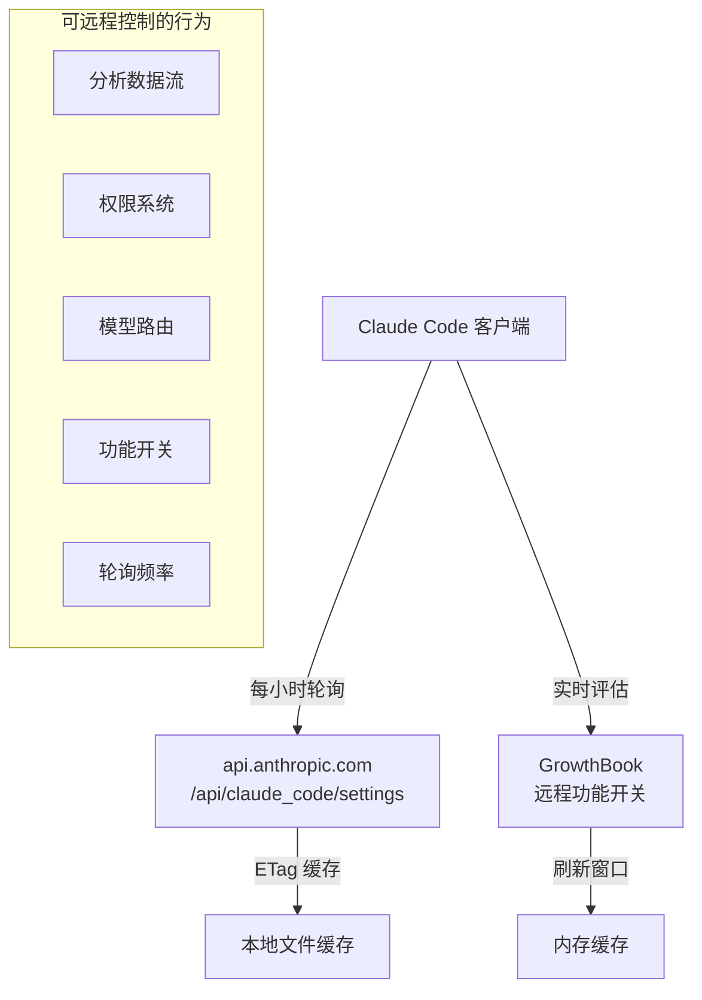

# 远程控制与紧急开关

> Anthropic 可以通过远程配置实时修改 Claude Code 的行为，甚至完全禁用某些功能。

---

## 远程管理架构



---

## 远程托管设置（Enterprise 功能）

### 轮询机制

| 参数 | 值 |
|------|-----|
| 轮询间隔 | 1 小时 (3,600,000ms) |
| HTTP 超时 | 10 秒 |
| 加载超时 | 30 秒 |
| 最大重试 | 5 次（指数退避） |

### API 端点

```
GET {BASE_API_URL}/api/claude_code/settings
```

### 认证方式

| 方式 | 请求头 | 适用用户 |
|------|--------|---------|
| API Key | `x-api-key` | Console 用户 |
| OAuth | `Bearer` + `anthropic-beta` | Claude.ai 用户 |

### 资格检查

```
✓ Console 用户（有 API Key）→ 全部符合
✓ OAuth Enterprise/C4E/Team 用户 → 符合
✗ 第三方提供商（Bedrock/Vertex）→ 不符合
✗ 自定义 API URL → 不符合
✗ Cowork VM 环境 → 不符合
```

### HTTP 缓存

- **ETag-based**: `If-None-Match` 请求头
- **304 Not Modified**: 使用缓存版本
- **Checksum 验证**: SHA256（兼容 Python `json.dumps(sort_keys=True)`）

### 安全检查

设置应用前需要用户确认（`securityCheck.tsx`）:
- 检查新旧设置差异
- 用户可以拒绝远程配置变更
- 拒绝后保持缓存或返回空

### 故障处理（Fail-Open）

```
远程设置 → 失败
    ↓
磁盘缓存 → 不存在
    ↓
默认设置 → 继续工作
```

**源码位置**: `src/services/remoteManagedSettings/`

---

## GrowthBook 功能开关

### 集成方式

- **SDK**: `@growthbook/growthbook`
- **模式**: Remote Eval（远程评估）
- **用户定向属性**: id, platform, subscriptionType, appVersion 等

### 缓存策略

| 方法 | 说明 |
|------|------|
| `getFeatureValue_CACHED_MAY_BE_STALE()` | 返回可能过期的缓存值 |
| `getFeatureValue_CACHED_WITH_REFRESH()` | 带刷新窗口的缓存 |
| `getDynamicConfig_CACHED_MAY_BE_STALE()` | 动态配置缓存 |

**源码位置**: `src/services/analytics/growthbook.ts`

---

## 紧急开关（Killswitch）列表

### 分析数据流

| 开关 | 控制 | 效果 |
|------|------|------|
| `tengu_frond_boric` | Datadog + FirstParty | 完全关闭数据上报 |
| `tengu_event_sampling_config` | 事件采样率 | 0-100% 采样 |
| `tengu_1p_event_batch_config` | 批处理配置 | 调整批大小/间隔 |

### 权限系统

| 开关 | 控制 | 效果 |
|------|------|------|
| `tengu_auto_mode_config` | 自动模式 | 禁用/启用/选项加入 |
| Statsig gate | 权限绕过 | 禁止 bypassPermissions |
| `TRANSCRIPT_CLASSIFIER` | 自动分类器 | 开关自动权限判断 |

### Bridge 远程控制

| 开关 | 控制 | 效果 |
|------|------|------|
| `tengu_bridge_poll_interval_config` | 轮询间隔 | 调整实时通信频率 |
| `tengu_bridge_min_version` | 最低版本 | 强制升级 |
| `tengu_sessions_elevated_auth_enforcement` | 认证升级 | 强制更强认证 |

**Bridge 轮询详细参数**:

```typescript
{
  poll_interval_ms_not_at_capacity: 2000,      // 空闲时 2 秒
  poll_interval_ms_at_capacity: 600000,        // 满载时 10 分钟
  session_keepalive_interval_v2_ms: 120000,    // 心跳 2 分钟
  reclaim_older_than_ms: 5000,                 // 回收阈值 5 秒
}
```

### KAIROS 系统

| 开关 | 控制 | 效果 |
|------|------|------|
| `tengu_kairos` | KAIROS 主开关 | 启用/禁用助手模式 |
| `tengu_kairos_cron_config` | 定时任务 | 速率限制和频率 |
| `tengu_kairos_brief` | Brief 功能 | 5 分钟刷新窗口 |

### 记忆系统

| 开关 | 控制 | 效果 |
|------|------|------|
| `tengu_moth_copse` | 记忆提取 | 启用/禁用 |
| `tengu_bramble_lintel` | 提取频率 | 默认 1 |
| `tengu_sm_compact_config` | 会话压缩 | 压缩参数 |

### 缓存和性能

| 开关 | 控制 | 效果 |
|------|------|------|
| `tengu_prompt_cache_1h_config` | 提示缓存 | 缓存参数 |
| `tengu_read_dedup_killswitch` | 读取去重 | 紧急关闭 |
| `tengu_compact_line_prefix_killswitch` | 行前缀压缩 | 紧急关闭 |

---

## 远程可修改的完整行为列表

| 行为 | 远程控制方式 | 影响范围 |
|------|-------------|---------|
| 数据上报 | tengu_frond_boric | 隐私 |
| 自动模式 | tengu_auto_mode_config | 权限 |
| 权限绕过 | Statsig gate | 安全 |
| 轮询频率 | tengu_bridge_poll_interval_config | 性能 |
| 事件采样 | tengu_event_sampling_config | 遥测 |
| 模型路由 | tengu_ant_model_override | 功能 |
| 记忆系统 | tengu_moth_copse | 功能 |
| 缓存策略 | tengu_prompt_cache_1h_config | 性能 |
| Bash 分类 | 影子模式开关 | 安全 |
| 版本限制 | tengu_max_version_config | 发布 |

---

## 安全评估

### 正面

- **Fail-Open 设计**: 远程服务不可用时正常工作
- **用户确认**: 企业设置变更需用户交互确认
- **Checksum 验证**: 防止中间人篡改
- **ETag 缓存**: 减少网络开销

### 风险

- **6+ 个紧急开关**可远程修改用户行为
- 权限系统可被远程调整（通过 Statsig gate）
- 分析数据流可被远程开关
- 用户**无法审计**远程配置变更历史
- 轮询间隔可被远程缩短（增加网络流量）
