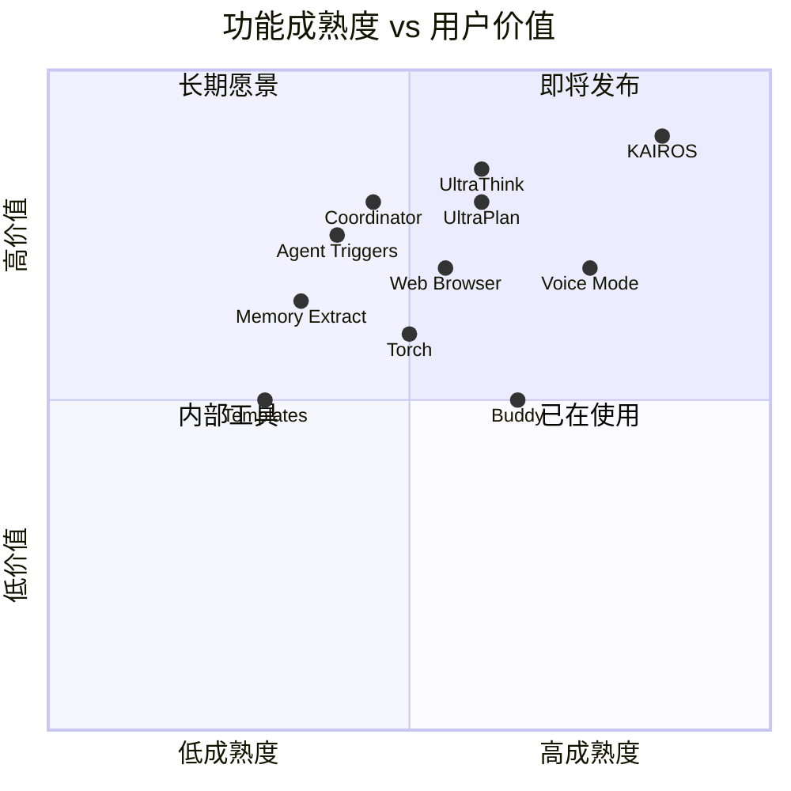

# 未来路线图

> 从 87 个 feature flags 和缺失模块中推测 Claude Code 的发展方向。

---

## 功能成熟度图谱

---

## Tier 1: 即将发布（成熟度 80%+）

### KAIROS — 自主助手平台

**这是 Claude Code 最大的未发布功能。**

| 子系统 | 说明 | 成熟度 |
|--------|------|--------|
| Assistant Mode | 助手交互模式 | 95% |
| Brief Tool | 消息检查点/简报 | 90% |
| Channels | 频道系统（MCP 集成） | 85% |
| Cron Tasks | 定时任务调度 | 85% |
| GitHub Webhooks | PR 订阅和通知 | 80% |
| Push Notifications | 推送通知 | 75% |
| Dream | 记忆整合（离线学习） | 70% |

**预测**: KAIROS 将成为 Claude Code 从"编码工具"到"自主开发伙伴"的转型核心。

### Voice Mode — 语音交互

| 组件 | 说明 |
|------|------|
| Voice STT | 语音转文本 |
| Audio Capture | 原生音频采集（跨平台 .node 模块） |
| Voice Integration Hook | React 集成 |

**证据**: `vendor/audio-capture/` 包含 6 个平台的原生二进制文件（arm64/x64 × darwin/linux/win32），说明已进入跨平台测试阶段。

---

## Tier 2: 积极开发中（成熟度 50-80%）

### UltraPlan + UltraThink

- **UltraPlan**: 扩展计划生成，含选择对话框
- **UltraThink**: 深度推理模式
- **Torch**: 推理增强（可能与 UltraThink 互补）

**预测**: 这三者可能合并为一个"深度思考"模式，类似 o1/o3 的竞品。

### Buddy — AI 精灵伙伴

- 45K 字节的 CompanionSprite 动画系统
- 通知系统
- 伙伴人格

**预测**: 可能作为桌面应用的差异化功能发布，但优先级可能低于核心功能。

### Web Browser Tool

- MCP 工具形式的内嵌浏览器
- 面板 UI

**预测**: 对于需要浏览文档/网页的开发任务，这是刚需。

---

## Tier 3: 实验阶段（成熟度 30-50%）

### Coordinator Mode — 多智能体协调

目前只有 1 个文件 (`src/coordinator/`)，但:
- 已有专用 system prompt（优先级 1）
- 可通过环境变量启用
- 支持多 Worker 分配

**预测**: 这是向"AI 开发团队"演进的基础，但距离公开发布还需要时间。

### Agent Triggers — 自动化代理

- 定时执行（cron 调度）
- 远程触发
- 与 KAIROS 深度集成

**预测**: 将成为 CI/CD 集成的关键能力。

### Memory System — 记忆系统增强

| 功能 | 说明 |
|------|------|
| Extract Memories | 自动从对话中提取记忆 |
| Agent Memory Snapshot | 代理级记忆快照 |
| Team Memory Sync | 团队记忆同步 |
| Templates | 任务模板和分类 |

**预测**: 记忆系统将从"用户手动管理"演进到"AI 自动学习"。

---

## Tier 4: 108 个缺失模块

npm 发布版中有 108 个模块被 dead-code-eliminated，只存在于 Anthropic 内部 monorepo:

| 类别 | 包含 |
|------|------|
| **守护进程** | daemon 系统、后台任务调度 |
| **技能发现** | skill search、skill generator |
| **浏览器** | WebBrowserTool、REPL Tool |
| **监控** | MonitorTool、性能追踪 |
| **远程** | Bridge 完整服务端、CCR 镜像 |
| **协作** | 频道系统、团队记忆同步 |
| **AI 伙伴** | Buddy 精灵完整系统 |

---

## 发展方向预测

### 短期（1-3 个月）

1. **Voice Mode 公开发布** — 跨平台二进制已就绪
2. **UltraThink/UltraPlan 合并** — 深度推理模式
3. **Web Browser Tool** — MCP 集成

### 中期（3-6 个月）

4. **KAIROS 逐步开放** — 从 Enterprise 到全量
5. **Agent Triggers** — CI/CD 自动化
6. **Coordinator Mode** — 多代理协作

### 长期（6-12 个月）

7. **AI 开发团队** — Coordinator + KAIROS + Memory
8. **自主开发循环** — Agent 自主发现问题 → 修复 → 验证
9. **团队协作** — 多人 + 多 Agent 混合工作流

---

## 竞争格局影响

| 功能 | Claude Code | Cursor | Cline |
|------|------------|--------|-------|
| 自主代理 (KAIROS) | 开发中 | 无 | 无 |
| 语音交互 | 开发中 | 无 | 无 |
| 多代理协调 | 实验中 | 无 | 无 |
| AI 伙伴 | 实验中 | 无 | 无 |
| 深度推理 | 开发中 | 部分 | 无 |
| 网页浏览 | 开发中 | 无 | 无 |

**结论**: Claude Code 正在从"AI 编码助手"向"AI 开发平台"演进，其功能规划远超当前竞品。
