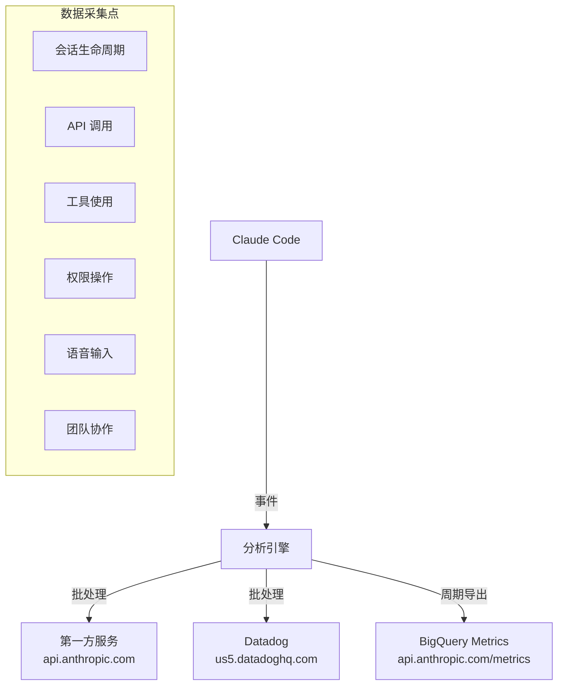

# 遥测与隐私分析

> 基于 Claude Code v2.1.88 源码，完整还原数据采集、传输和隐私保护机制。

---

## 架构概览



## 双通道遥测

### 通道 1：第一方事件日志

- **端点**: `https://api.anthropic.com/api/event_logging/batch`
- **批处理**: 5 秒延迟或 200 条事件
- **失败处理**: 持久化到 `~/.claude/telemetry/`，最多 8 次指数退避重试
- **事件类型**: 640+ 种

**源码位置**: `src/services/analytics/firstPartyEventLoggingExporter.ts`

### 通道 2：Datadog

- **端点**: `https://http-intake.logs.us5.datadoghq.com/api/v2/logs`
- **API Token**: `pubbbf48e6d78dae54bceaa4acf463299bf`（公开令牌）
- **批处理**: 15 秒或 100 条事件
- **允许事件**: 64 种（白名单过滤）
- **无重试**: 异步发送，失败即丢弃

**源码位置**: `src/services/analytics/datadog.ts`

### 通道 3：BigQuery 指标

- **端点**: `https://api.anthropic.com/api/claude_code/metrics`
- **周期**: 60 秒
- **需要 API 认证**

**源码位置**: `src/utils/telemetry/bigqueryExporter.ts`

---

## 采集的数据

### 环境信息

```typescript
{
  platform: 'darwin|win32|linux',
  arch: 'x64|arm64',
  node_version: string,
  terminal: string,
  package_managers: string,    // npm, yarn, pnpm...
  runtimes: string,            // python, node, ruby...
  is_ci: boolean,
  is_github_action: boolean,
  version: string,             // Claude Code 版本
  wsl_version: string,         // WSL 版本
  linux_distro_id: string,
}
```

### 用户标识

| 字段 | 说明 | 隐私处理 |
|------|------|---------|
| device_id | 设备标识 | 去标识化 |
| user_bucket | 用户哈希桶 | 30 个桶（SHA256 取模） |
| session_id | 会话标识 | 临时 |
| user_type | 用户类型 | ant/external |
| subscription_type | 订阅类型 | max/pro/enterprise/team |

### 关键事件类型

| 分类 | 事件示例 | 采集内容 |
|------|---------|---------|
| 会话 | `tengu_init/started/exit` | 启动时间、退出原因 |
| API | `tengu_api_success/error` | 模型、token 用量、耗时、缓存状态 |
| 工具 | `tengu_tool_use_success/error` | 工具名称（MCP 工具匿名化为 `mcp_tool`） |
| 权限 | `tengu_tool_use_granted/rejected` | 授权类型（永久/临时/拒绝） |
| 语音 | `tengu_voice_toggled` | 开关状态 |
| 团队 | `tengu_team_mem_sync_push/pull` | 同步操作 |

---

## 隐私保护机制

### 1. 工具名称清理

```typescript
// MCP 工具名称匿名化
mcp__my_secret_tool → mcp_tool
// 内置工具保留原名
Bash → Bash
```

**源码位置**: `src/services/analytics/metadata.ts`

### 2. 文件路径保护

```
仅记录文件扩展名，不记录完整路径
MAX_FILE_EXTENSION_LENGTH = 10
```

### 3. 用户 ID 哈希

```typescript
// 30 个桶，无法反推具体用户
getUserBucket() = SHA256(userId) % 30
```

### 4. 消息指纹

```typescript
// 仅取第 4、7、20 位字符 + 版本号
// 无法还原原始消息
fingerprint = SHA256(salt + char[4] + char[7] + char[20] + version)[:3]
```

### 5. 用户提示不记录

```
默认不记录用户输入内容
需要手动设置 OTEL_LOG_USER_PROMPTS=1 才启用
```

---

## 如何禁用遥测

### 方法 1：禁用分析遥测

```bash
export DISABLE_TELEMETRY=1
```

**效果**: 关闭 Datadog、第一方事件日志、反馈调查

### 方法 2：禁用所有非必要网络

```bash
export CLAUDE_CODE_DISABLE_NONESSENTIAL_TRAFFIC=1
```

**效果**: 关闭所有非 API 通信

### 自动禁用的情况

- `NODE_ENV=test` — 测试环境
- 使用第三方云提供商（Bedrock/Vertex/Foundry）

---

## 远程采样控制

Anthropic 可通过 GrowthBook 远程调整:

```typescript
// 采样率配置
tengu_event_sampling_config: { 'event_name': { sample_rate: 0.1 } }

// 数据流紧急开关
tengu_frond_boric: { datadog: false, firstParty: false }
```

---

## 关键源文件

| 文件 | 功能 |
|------|------|
| `src/services/analytics/index.ts` | 分析主入口 |
| `src/services/analytics/datadog.ts` | Datadog 集成 |
| `src/services/analytics/firstPartyEventLogger.ts` | 第一方事件 |
| `src/services/analytics/metadata.ts` | 元数据收集与清理 |
| `src/services/analytics/config.ts` | 遥测配置 |
| `src/services/analytics/growthbook.ts` | GrowthBook 集成 |
| `src/services/analytics/sinkKillswitch.ts` | 紧急开关 |
| `src/utils/telemetry/instrumentation.ts` | OpenTelemetry 初始化 |
| `src/utils/fingerprint.ts` | 指纹生成 |

---

## 总结

| 维度 | 评价 |
|------|------|
| 数据采集范围 | **广** — 640+ 事件类型，覆盖几乎所有操作 |
| PII 保护 | **中等** — 哈希化、匿名化，但环境指纹仍可关联 |
| 用户控制 | **有限** — 可禁用遥测，但无法选择性关闭特定采集点 |
| 透明度 | **低** — 无 UI 界面展示采集内容，需读源码才能了解 |
| 远程控制 | **有** — Anthropic 可远程调整采样率和开关 |
