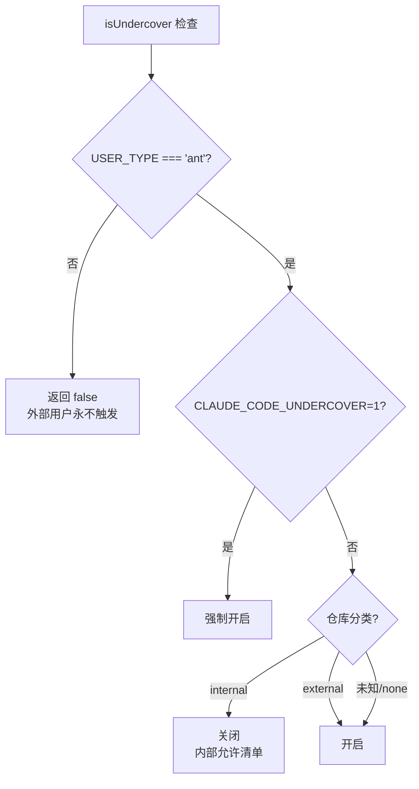

# 卧底模式分析

> Anthropic 内部员工在公开仓库工作时，Claude Code 会自动隐藏所有内部信息。

---

## 什么是卧底模式

当 Anthropic 员工（`USER_TYPE=ant`）在公开或非内部仓库中使用 Claude Code 时，系统自动激活"卧底模式"，隐藏所有可能暴露内部信息的内容。

**仅影响 Anthropic 内部用户，外部用户完全不受影响。**

---

## 激活条件



**关键设计: 安全默认** — 无法确认是内部仓库时，默认开启卧底模式。

**源码位置**: `src/utils/undercover.ts` 第 28-37 行

---

## 内部仓库允许清单

以下仓库被标记为"内部"，卧底模式**不会**在这些仓库中激活:

```
anthropics/claude-cli-internal
anthropics/anthropic
anthropics/apps
anthropics/casino
anthropics/dbt
anthropics/dotfiles
anthropics/terraform-config
anthropics/hex-export
anthropics/feedback-v2
anthropics/labs
anthropics/argo-rollouts
anthropics/starling-configs
anthropics/ts-tools
anthropics/ts-capsules
anthropics/feldspar-testing
anthropics/trellis
anthropics/claude-for-hiring
anthropics/forge-web
anthropics/infra-manifests
anthropics/mycro_manifests
anthropics/mycro_configs
anthropics/mobile-apps
```

**注意**: `anthropics/claude-code` 等公开仓库**不在**允许清单中，所以卧底模式会在这些仓库中激活。

**源码位置**: `src/utils/commitAttribution.ts` 第 30-75 行

---

## 卧底模式做了什么

### 1. 注入强制隐蔽指令

系统自动向 commit/PR 提示词中注入:

```
## UNDERCOVER MODE — CRITICAL

You are operating UNDERCOVER in a PUBLIC/OPEN-SOURCE repository. Your commit
messages, PR titles, and PR bodies MUST NOT contain ANY Anthropic-internal
information. Do not blow your cover.

NEVER include in commit messages or PR descriptions:
- Internal model codenames (animal names like Capybara, Tengu, etc.)
- Unreleased model version numbers (e.g., opus-4-7, sonnet-4-8)
- Internal repo or project names (e.g., claude-cli-internal, anthropics/…)
- Internal tooling, Slack channels, or short links (e.g., go/cc, #claude-code-…)
- The phrase "Claude Code" or any mention that you are an AI
- Any hint of what model or version you are
- Co-Authored-By lines or any other attribution
```

注入位置:
- `/commit` 命令 (`src/commands/commit.ts`)
- `/commit-push-pr` 命令 (`src/commands/commit-push-pr.ts`)
- Bash 工具提示词 (`src/tools/BashTool/prompt.ts`)

### 2. 剥离所有归属信息

```typescript
// 卧底模式
getAttributionTexts() → { commit: '', pr: '' }

// 正常模式
getAttributionTexts() → {
  commit: 'Co-Authored-By: Claude Opus 4.6 <noreply@anthropic.com>',
  pr: '🤖 Generated with Claude Code'
}
```

**源码位置**: `src/utils/attribution.ts` 第 52-98 行

### 3. 隐藏模型标识

卧底模式下，系统提示词中不包含当前使用的模型名称。

---

## 内部 vs 外部用户行为对比

| 功能 | 内部用户 (ant) | 外部用户 |
|------|---------------|---------|
| 卧底模式检查 | 完整检查 | 代码被编译时消除 |
| 卧底提示注入 | 条件注入 | 代码不存在 |
| 归属剥离 | 卧底时剥离 | 始终显示归属 |
| 增强 PR 归属 | 显示贡献百分比 | 标准归属 |
| PR 追踪行 | 内部仓库可用 | 不可用 |
| `CLAUDE_CODE_UNDERCOVER` 环境变量 | 有效 | 无效（代码不存在） |

### 增强 PR 归属（仅内部仓库）

正常模式下，内部用户的 PR 描述可能包含:

```
🤖 Generated with Claude Code (93% 3-shotted by claude-opus-4-5, 2 memories recalled)
```

卧底模式下: 完全移除。

---

## 自动通知机制

首次进入卧底模式时，系统显示通知弹窗:

```typescript
shouldShowUndercoverAutoNotice():
  1. USER_TYPE === 'ant'
  2. 不是环境变量强制开启
  3. 确实处于卧底模式
  4. 未显示过通知 (hasSeenUndercoverAutoNotice)
```

显示一次后不再重复。

**源码位置**: `src/utils/undercover.ts` 第 80-89 行, `src/screens/REPL.tsx` 第 1025 行

---

## 安全设计亮点

### 防御纵深

```
构建时: 外部构建不包含卧底代码 (dead code elimination)
    ↓
运行时: USER_TYPE 检查
    ↓
仓库级: 允许清单白名单
    ↓
提示级: 强制 CRITICAL 指令
    ↓
输出级: 归属信息剥离
```

### 安全默认

- 未确认内部仓库 → 默认开启卧底
- **没有**强制关闭选项（防止误操作）
- 内部允许清单用**白名单**（不是黑名单）

---

## 对外部用户的意义

虽然卧底模式只影响 Anthropic 员工，但它揭示了:

1. **Anthropic 员工大量使用 Claude Code** — 否则不需要如此复杂的机制
2. **内部有大量未公开信息** — 动物代号（Capybara/Tengu）、未发布版本号、内部工具链
3. **PR 追踪表明 Claude 贡献度可量化** — 93% AI 生成并非不可能
4. **归属信息的存在暗示合规需求** — 未来可能要求所有 AI 生成内容标注
