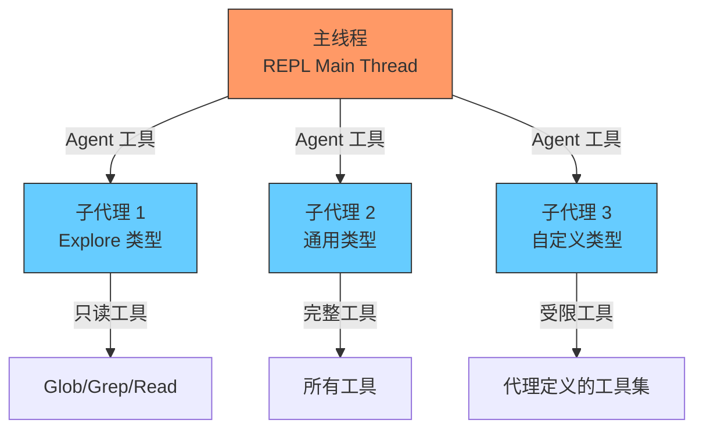
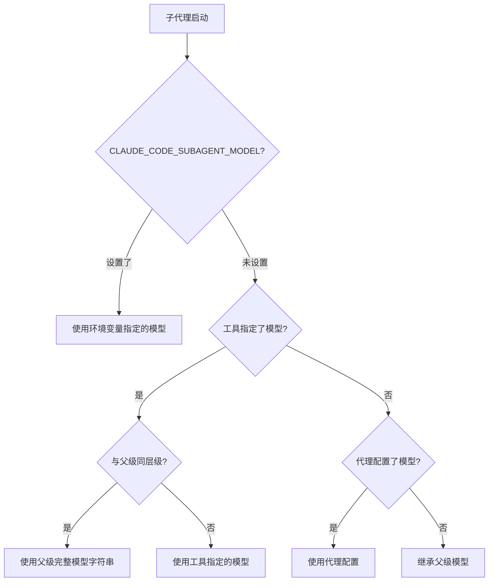
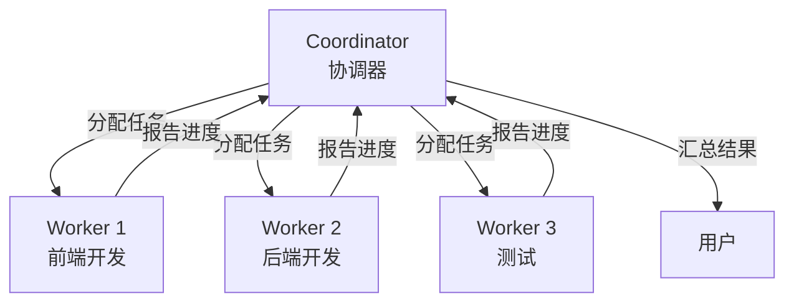

# 多代理协调架构

> Claude Code 支持子代理派生和多代理协调，是其处理复杂任务的核心能力。

## 代理层级



## 子代理类型

| 类型 | 工具集 | 用途 | 模型 |
|------|--------|------|------|
| `general-purpose` | 全部 | 复杂多步骤任务 | 继承父级 |
| `Explore` | 只读（无 Edit/Write） | 代码库探索 | 继承父级 |
| `Plan` | 只读（无 Edit/Write） | 设计实现方案 | 继承父级 |
| 内置代理 (60+) | 按定义 | 专业领域任务 | 可指定 |
| 自定义代理 | 按配置 | 用户定义 | 可指定 |

## 子代理模型路由



**关键细节**: 如果代理配置写 `model: "opus"`，但父级是 `claude-opus-4-6`，系统会匹配到同家族并使用父级的完整模型 ID，避免意外降级。

**源码位置**: `src/utils/model/agent.ts` 第 37-95 行

## Coordinator 模式

启用 `COORDINATOR_MODE` 后，进入多 Worker 编排:



Coordinator 使用专用 system prompt（优先级 1），高于默认 prompt。

**源码位置**: `src/coordinator/`

## Worktree 隔离

子代理可在 Git worktree 中运行，获得仓库的隔离副本:

```
主代理: /project (main branch)
  └─ 子代理: /tmp/worktree-xxx (临时分支)
       ├─ 完整的仓库副本
       ├─ 独立的文件修改
       └─ 完成后: 合并或清理
```

**好处**: 子代理的文件修改不影响主工作目录。

## KAIROS 自主代理（未公开）

启用 KAIROS/PROACTIVE 后的自主模式:

```
特有机制:
├─ Tick 机制 — 定时唤醒执行任务
├─ SleepTool — 主动休眠等待
├─ 首次唤醒行为 — 自动扫描环境
├─ 终端焦点感知 — 检测用户是否在看
├─ Brief 工具 — 消息检查点
└─ 偏向行动 — 减少确认，直接执行
```

**源码位置**: `src/constants/prompts.ts` (KAIROS/Proactive 部分)
