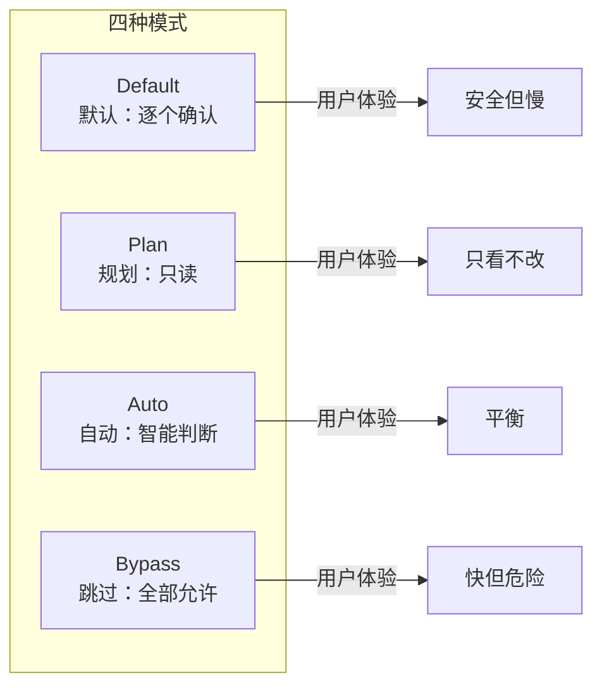
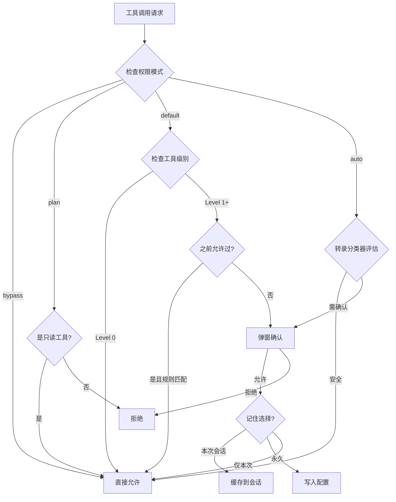
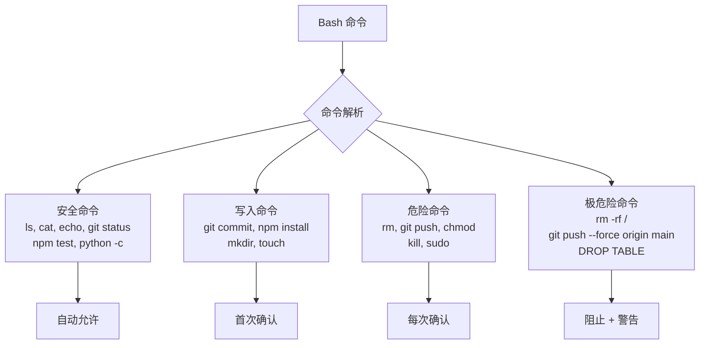

# 权限模型架构

> Claude Code 的每个工具调用都经过权限检查。理解这个模型能帮你更高效地使用它。

## 权限模式



## 工具权限分级

### Level 0: 自动允许（只读操作）

```
Read (FileReadTool)     — 读取文件
Glob (GlobTool)         — 搜索文件名
Grep (GrepTool)         — 搜索文件内容
LSP                     — 语言服务器
TaskGet/TaskList         — 查看任务
ToolSearch              — 搜索工具
AskUserQuestion         — 向用户提问
EnterPlanMode           — 进入规划
ExitPlanMode            — 退出规划
```

### Level 1: 首次确认（写操作）

```
Write (FileWriteTool)   — 创建/覆盖文件
Edit (FileEditTool)     — 编辑文件
NotebookEdit            — 编辑 Notebook
WebFetch                — 抓取网页
WebSearch               — 网页搜索
Bash (安全命令)          — ls, git status, npm test 等
Skill                   — 执行技能
```

### Level 2: 每次确认（危险操作）

```
Bash (危险命令)          — rm, git push, chmod 等
EnterWorktree           — 创建 worktree
```

### Level 3: 特殊处理

```
Bash (极危险)            — rm -rf, git push --force
                         — 数据库 DROP 操作
                         — 杀进程 (kill -9)
```

## 权限检查流程



## Bash 命令分类



## 配置权限规则

在 `settings.json` 中可自定义:

```json
{
  "permissions": {
    "allow": [
      "Bash(npm test)",
      "Bash(git diff)",
      "Write(src/**)"
    ],
    "deny": [
      "Bash(rm -rf *)",
      "Bash(git push --force)"
    ]
  }
}
```

**源码位置**: `src/hooks/toolPermission/`, `src/utils/settings/`

## Auto 模式的秘密

Auto 模式使用 **Transcript Classifier**（转录分类器）:

1. 分析当前对话上下文
2. 评估工具调用的安全性
3. 对明显安全的操作自动放行
4. 对有风险的操作仍然弹窗确认

这是一个 feature-gated 功能 (`TRANSCRIPT_CLASSIFIER`)，可能在未来版本中进一步优化。

**源码位置**: `src/main.tsx` 第 171 行
