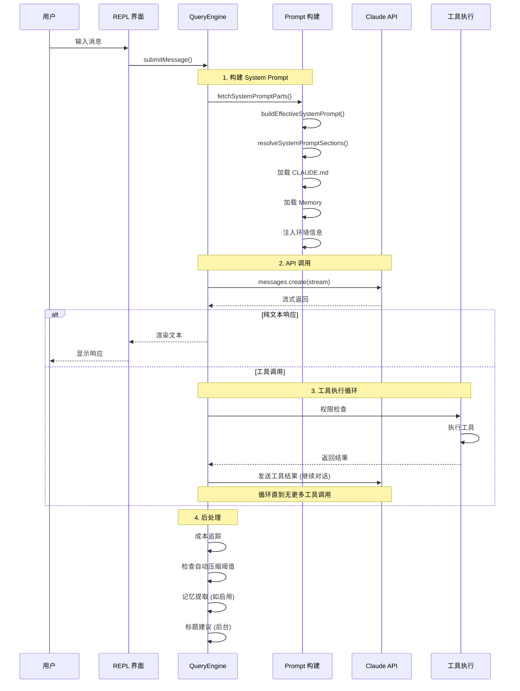
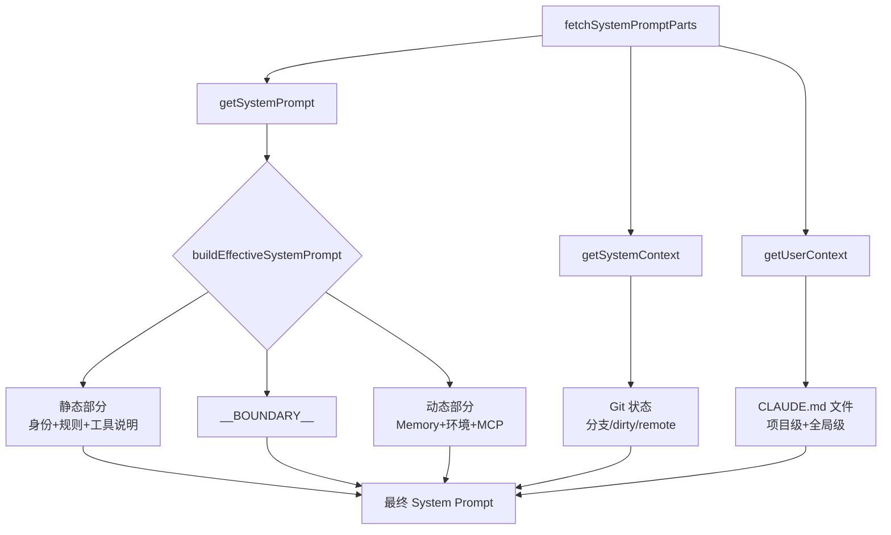
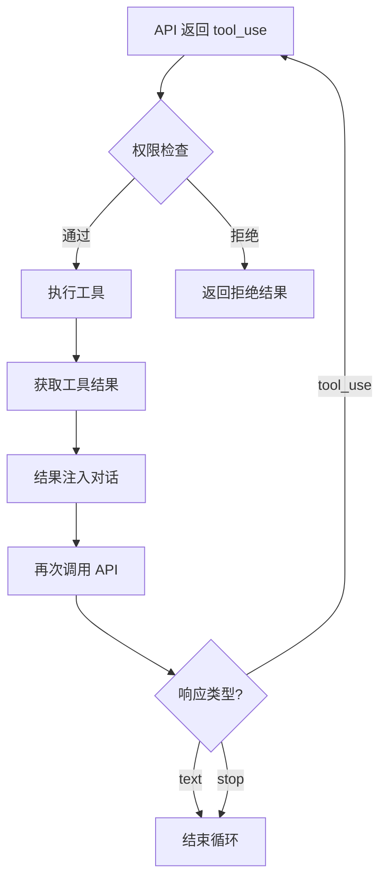

# 请求生命周期

> 从用户输入到 Claude 响应的完整链路。

## 完整流程



## 各阶段详解

### 阶段 1: System Prompt 构建



关键优化: 静态部分可被 API prompt caching，动态部分每次重算。

### 阶段 2: API 调用

```
请求体结构:
{
  model: "claude-opus-4-6",
  max_tokens: 8000,           // 初始值（非 32k）
  system: [系统提示],
  messages: [对话历史],
  tools: [工具定义],
  stream: true,
  metadata: { user_id: hash }
}
```

**重试策略**:
- 429 (Rate Limit): 等待 + 重试
- 529 (Overloaded): 仅前台任务重试
- max_tokens 命中: 自动升级到 64k 重试

### 阶段 3: 工具执行循环



单次对话中可能循环数十次（复杂任务）。

### 阶段 4: 后处理

```
并行执行:
├─ addToTotalSessionCost()      # 成本记录
├─ checkAutoCompactThreshold()  # 上下文压缩检查
├─ extractMemories()            # 记忆提取 (feature-gated)
├─ suggestTitle()               # 标题建议 (后台，不重试)
└─ updateSessionHistory()       # 历史记录
```

## 关键数字

| 节点 | 参数 |
|------|------|
| 初始 max_tokens | 8,000 |
| 升级 max_tokens | 64,000 |
| 上下文窗口 | 200,000 |
| 自动压缩阈值 | ~167,000 |
| 工具并行调用 | 支持 |
| 流式输出 | 始终启用 |

**源码位置**: `src/QueryEngine.ts` (~46K 行), `src/query.ts`
