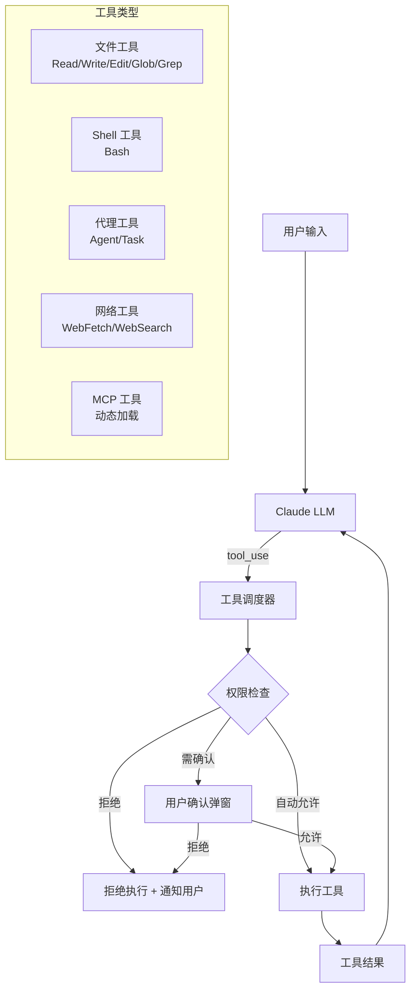
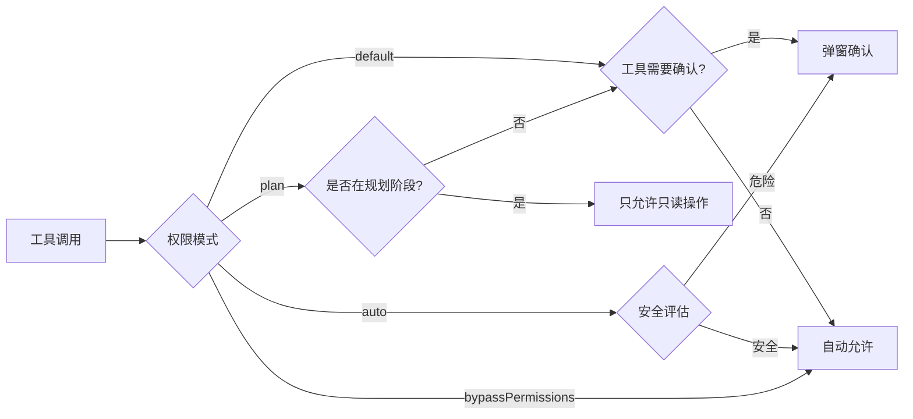

# 工具系统架构

> Claude Code 的工具系统是其核心能力的基础。每个工具都是自包含模块，有独立的输入验证、权限模型和执行逻辑。

## 工具调用总览



## 40+ 内置工具分类

### 文件操作 (6个)

| 工具 | 功能 | 权限级别 |
|------|------|---------|
| Read (FileReadTool) | 读取文件内容 | 自动允许 |
| Write (FileWriteTool) | 创建/覆盖文件 | 需确认 |
| Edit (FileEditTool) | 精确字符串替换 | 需确认 |
| Glob (GlobTool) | 文件模式匹配搜索 | 自动允许 |
| Grep (GrepTool) | 内容正则搜索 | 自动允许 |
| NotebookEdit | Jupyter Notebook 编辑 | 需确认 |

### 执行 (2个)

| 工具 | 功能 | 权限级别 |
|------|------|---------|
| Bash (BashTool) | Shell 命令执行 | 按命令分级 |
| LSP | Language Server Protocol 调用 | 自动允许 |

### 代理 (4个)

| 工具 | 功能 | 权限级别 |
|------|------|---------|
| Agent (SubagentTool) | 启动子代理 | 自动允许 |
| TaskCreate | 创建任务 | 自动允许 |
| TaskUpdate | 更新任务状态 | 自动允许 |
| TaskGet/List | 查询任务 | 自动允许 |

### 网络 (2个)

| 工具 | 功能 | 权限级别 |
|------|------|---------|
| WebFetch | 抓取 URL 内容 | 需确认 |
| WebSearch | 网页搜索 | 需确认 |

### 交互 (3个)

| 工具 | 功能 | 权限级别 |
|------|------|---------|
| AskUserQuestion | 向用户提问 | 自动允许 |
| Skill | 执行技能 | 需确认 |
| ToolSearch | 搜索延迟加载的工具 | 自动允许 |

### 计划/状态 (3个)

| 工具 | 功能 | 权限级别 |
|------|------|---------|
| EnterPlanMode | 进入规划模式 | 自动允许 |
| ExitPlanMode | 退出规划模式 | 自动允许 |
| EnterWorktree/Exit | Git worktree 隔离 | 需确认 |

## 工具定义结构

每个工具在 `src/tools/` 下是一个独立模块:

```
src/tools/
├── BashTool/
│   ├── BashTool.ts          # 工具定义和执行逻辑
│   ├── permissions.ts       # 权限规则
│   ├── constants.ts         # 常量
│   └── utils.ts             # 工具函数
├── FileReadTool/
├── FileWriteTool/
├── FileEditTool/
├── GlobTool/
├── GrepTool/
├── SubagentTool/
├── WebFetchTool/
└── ...
```

**源码位置**: `src/Tool.ts` (~29K 行) 定义基础类型, `src/tools.ts` 注册所有工具

## 权限模型



### 权限分级

```
Level 0 (自动允许): Read, Glob, Grep, TaskGet, ToolSearch
Level 1 (首次确认): Write, Edit, WebFetch, WebSearch
Level 2 (每次确认): Bash(危险命令), 删除操作
Level 3 (永不自动): rm -rf, git push --force, 数据库操作
```

**源码位置**: `src/hooks/toolPermission/`
