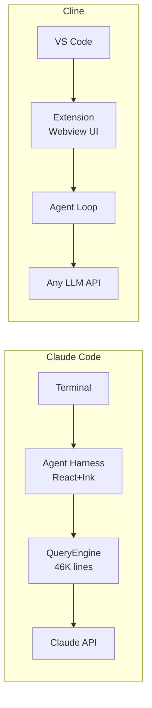

# Claude Code vs Cline: The Open-Source Alternative

> Cline (formerly Claude Dev) is the most popular open-source AI coding assistant. How does it compare to Anthropic's own tool?

---

## Overview

| | Claude Code | Cline |
|--|------------|-------|
| **License** | Proprietary | Apache 2.0 |
| **Form factor** | Terminal CLI | VS Code extension |
| **Model lock-in** | Claude only | Any OpenAI-compatible API |
| **Cost** | Per-token / subscription | Free (bring your own API keys) |

## Architecture

**Claude Code**: Monolithic agent harness (~512K lines). QueryEngine alone is 46K lines.

**Cline**: Lean VS Code extension. Single agent loop with approval gates. Much simpler, fully auditable.

## Permission Model -- Opposite Philosophies

| Aspect | Claude Code | Cline |
|--------|------------|-------|
| **Default** | Ask on first use, remember | Ask for every action |
| **Modes** | 4 modes (Default/Auto/Plan/Bypass) | Normal / Auto-approve / YOLO |
| **Bash parsing** | Command classification (safe/write/danger/critical) | Show command, user decides |

Claude Code analyzes commands and classifies risk. Cline shows everything and lets the user decide.

## Context Management

| Aspect | Claude Code | Cline |
|--------|------------|-------|
| Context window | Up to 1M tokens | Depends on model |
| Auto-compaction | Yes (at ~167K) | No |
| Project instructions | CLAUDE.md (auto-loaded) | Via @-commands |
| Persistent memory | Yes (cross-session) | No |
| Session resume | `--continue` flag | No |

## Model Flexibility -- Cline's Biggest Advantage

Cline works with any LLM: OpenAI, Claude, Gemini, Bedrock, Azure, OpenRouter, Ollama, LM Studio, or any OpenAI-compatible endpoint.

Claude Code: Claude models only. No fallback if Anthropic has an outage.

## Multi-Agent

| Aspect | Claude Code | Cline |
|--------|------------|-------|
| Subagents | Yes (isolated fresh context) | No |
| Agent types | 60+ built-in + custom | Single type |
| Orchestration | Agent tool + hooks | Manual |

## Cost

| Scenario | Claude Code | Cline |
|----------|------------|-------|
| Software cost | Free CLI | Free |
| Cheapest API | Haiku 4.5 ($1/Mtok) | Local model (Ollama) = $0 |
| Cost visibility | `/cost` per-model breakdown | Provider dashboard |

## When to Choose Each

**Claude Code**: Persistent memory, complex multi-step tasks, Claude ecosystem commitment, sophisticated permissions, CLI workflows.

**Cline**: Model flexibility, open-source auditability, budget constraints (local models = $0), VS Code native, explicit human control.

---

> **Irony**: Cline was originally "Claude Dev" -- built for Claude. Now it's the most model-agnostic alternative to Anthropic's own tool.
