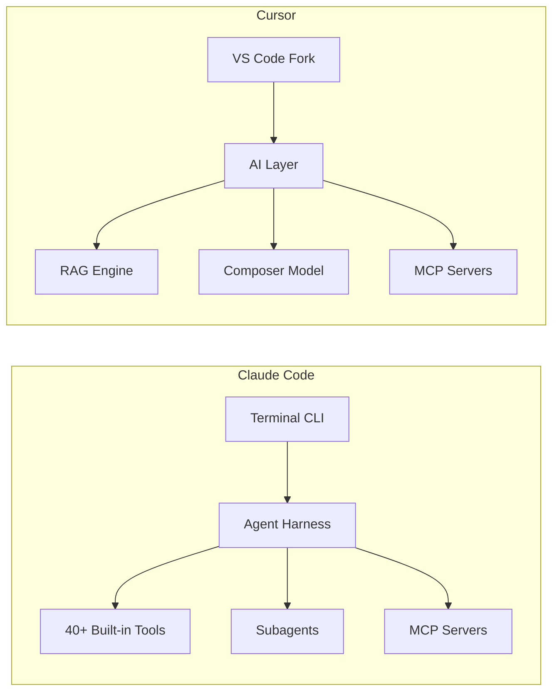

# Claude Code vs Cursor: Architecture Deep-Dive

> Two fundamentally different approaches to AI-assisted coding.

---

## Philosophy

| | Claude Code | Cursor |
|--|------------|--------|
| **Core belief** | CLI-first, composable Unix tool | GUI-first, integrated editor |
| **Metaphor** | An expert developer in your terminal | An AI-enhanced IDE |
| **Trust model** | Configurable permission levels | Implicit trust (agent executes) |

## Architecture



## Context Strategy

| Aspect | Claude Code | Cursor |
|--------|------------|--------|
| Indexing | None (on-demand search) | Pre-built AST + embeddings |
| Context window | Up to 1M tokens | ~272K (RAG-augmented) |
| Cold start | Instant | Indexing time on first open |
| Context quality | Everything in window | Relevance-ranked retrieval |

**Trade-off**: Claude Code is simpler but consumes more tokens. Cursor is faster for retrieval but adds indexing complexity.

## Multi-Agent

| Aspect | Claude Code | Cursor |
|--------|------------|--------|
| Max parallel agents | Subagents (no hard limit) | 8 |
| Isolation method | Fresh context | Git worktrees / remote VMs |
| Orchestration | Automatic delegation | Manual launch |

## Permission Model

Claude Code has a 4-level permission system:

```
Level 0: Auto-allow (read-only tools)
Level 1: First-time confirm (write tools)
Level 2: Every-time confirm (dangerous commands)
Level 3: Block + warn (destructive operations)
```

Cursor operates on implicit trust -- the agent executes without per-action approval.

## What Claude Code Has That Cursor Doesn't

- Persistent memory across sessions (MEMORY.md)
- CLAUDE.md project instructions (version-controlled)
- 87 feature flags for unreleased capabilities
- KAIROS autonomous agent platform (210 file references)
- Voice mode (cross-platform binaries ready)
- Hooks system for workflow automation
- Deep permission hierarchy (org -> project -> personal)

## What Cursor Has That Claude Code Doesn't

- Polished GUI with inline code suggestions
- Real-time autocomplete (Tab completion)
- Pre-built codebase indexing (AST + embeddings)
- Multi-model support (OpenAI, Gemini, xAI)
- 8 parallel agents (shipped, not feature-gated)
- Proprietary Composer model (MoE architecture)

---

> **Bottom line**: Claude Code is deeper (permission model, memory, extensibility). Cursor is wider (GUI, multi-model, autocomplete). They optimize for different workflows.
