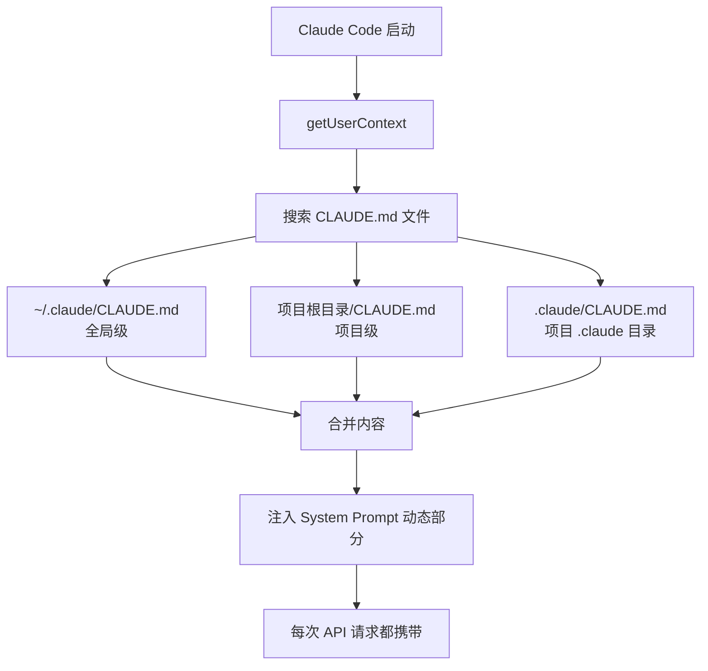

# CLAUDE.md 最佳实践指南

> 基于源码中 CLAUDE.md 的加载逻辑和 System Prompt 的优先级规则，告诉你怎么写真正有效的 CLAUDE.md。

---

## CLAUDE.md 是什么

CLAUDE.md 是 Claude Code 的项目级配置文件。它的内容会被注入到每次 API 请求的 system prompt 中。

## 加载机制



**源码位置**: `src/context.ts` → `getUserContext()`

## 优先级规则

```
System Prompt 硬编码规则 > CLAUDE.md > 用户对话指令
```

这意味着:
- CLAUDE.md **无法覆盖** system prompt 中的安全规则
- CLAUDE.md **无法覆盖** 工具使用偏好（专用工具 > Bash）
- CLAUDE.md **无法覆盖** emoji 禁用等风格规则
- CLAUDE.md **可以** 定义项目约定、技术栈、代码风格

## 成本影响

```
CLAUDE.md 每个字 ≈ 每次请求消耗的额外 token

100 字的 CLAUDE.md × 50 次请求/小时 × Opus $5/Mtok
≈ 微小成本

2000 字的 CLAUDE.md × 50 次请求/小时 × Opus $5/Mtok
≈ 成本开始可感知

如果你用快速模式 (6倍价格):
2000 字 × 50 次 × $30/Mtok = 不可忽视
```

**原则: 写得精炼 = 省钱。**

---

## 推荐模板

```markdown
# CLAUDE.md

## 技术栈
- 语言: TypeScript 5.x, strict mode
- 框架: Next.js 14, App Router
- 测试: vitest + @testing-library/react
- 包管理: pnpm

## 代码约定
- 组件用 PascalCase, hooks 用 camelCase
- 提交格式: conventional commits (feat/fix/chore)
- 分支: feature/xxx, fix/xxx

## 项目结构
- src/app/ — 页面路由
- src/components/ — 共享组件
- src/lib/ — 工具函数
- src/types/ — 类型定义

## 重要上下文
- API 基于 tRPC，端点在 src/server/routers/
- 数据库用 Drizzle ORM，schema 在 src/db/schema.ts
- 环境变量在 .env.local，不要提交
```

## 不要写的内容

### 1. 不要重复 System Prompt 已有的规则

```markdown
# 错误示例
- 你是一个 AI 编程助手  ← system prompt 已有
- 修改代码前请先阅读     ← system prompt 已有
- 不要引入安全漏洞       ← system prompt 已有
- 使用专用工具而非 bash  ← system prompt 已有
```

### 2. 不要写长篇说明

```markdown
# 错误示例
本项目是一个基于 React 的前端应用，主要用于管理用户的个人信息。
项目开始于 2024 年，目前由 3 个开发者维护。我们的目标是提供
一个简洁、高效的用户管理界面...

# 正确做法
简洁列出技术决策和约定即可。背景信息让 Claude 自己读 README。
```

### 3. 不要放参考文档

```markdown
# 错误示例
## API 文档
GET /api/users - 获取用户列表
  参数: page, limit, sort
  返回: { data: User[], total: number }
...（200行 API 文档）

# 正确做法
## API
参见 src/server/routers/ 和 docs/api.md
```

### 4. 不要放临时任务

```markdown
# 错误示例
## 当前任务
- 修复登录页面的 bug
- 添加用户导出功能

# 正确做法
直接在对话中说。CLAUDE.md 是持久配置，不是 todo list。
```

---

## 高级用法

### 全局 CLAUDE.md（适用于所有项目）

```bash
# 路径: ~/.claude/CLAUDE.md
```

```markdown
# 全局偏好
- 用中文回复
- git commit message 用英文
- 不用 emoji
```

### 项目级 CLAUDE.md

```bash
# 路径: 项目根目录/CLAUDE.md
```

项目特定的技术栈和约定。

### 禁用 CLAUDE.md

```bash
CLAUDE_CODE_DISABLE_CLAUDE_MDS=1 claude
```

**源码位置**: `src/context.ts`

---

## Memory 系统 vs CLAUDE.md

| 维度 | CLAUDE.md | Memory |
|------|-----------|--------|
| 位置 | 项目根目录 | ~/.claude/projects/ |
| 加载时机 | 每次请求 | 每次请求 |
| 管理方式 | 手动编辑 | Claude 自动管理 |
| 适合内容 | 项目约定、技术栈 | 用户偏好、历史决策 |
| 团队共享 | 可提交到 Git | 个人 |
| token 成本 | 直接影响 | 直接影响 |

**建议**: CLAUDE.md 放团队共享的项目配置，Memory 放个人偏好。

---

## 验证你的 CLAUDE.md 是否生效

```bash
# 方法 1: 直接问 Claude
> 你能看到我的 CLAUDE.md 内容吗？

# 方法 2: 检查上下文
/context

# 方法 3: 在对话中测试约定是否被遵守
> 创建一个新组件（检查是否遵循你定义的命名约定）
```
